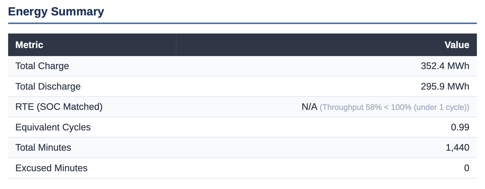
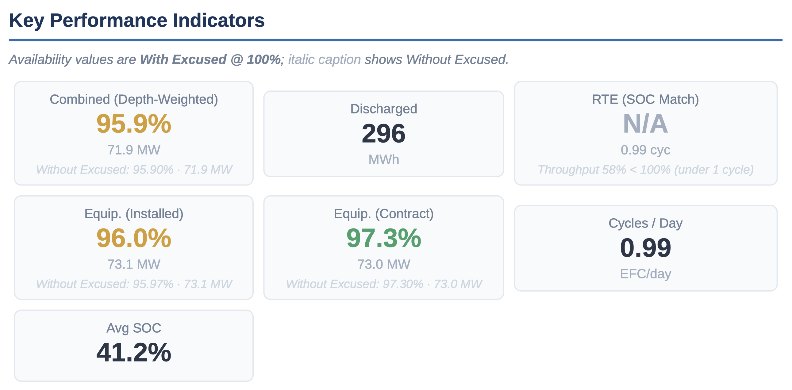
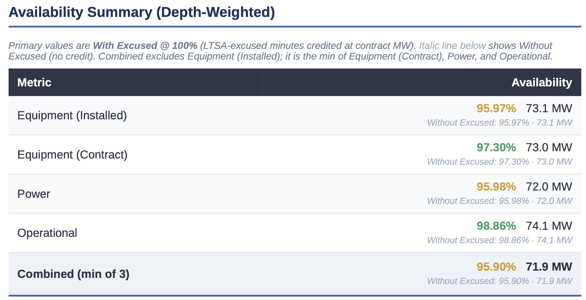
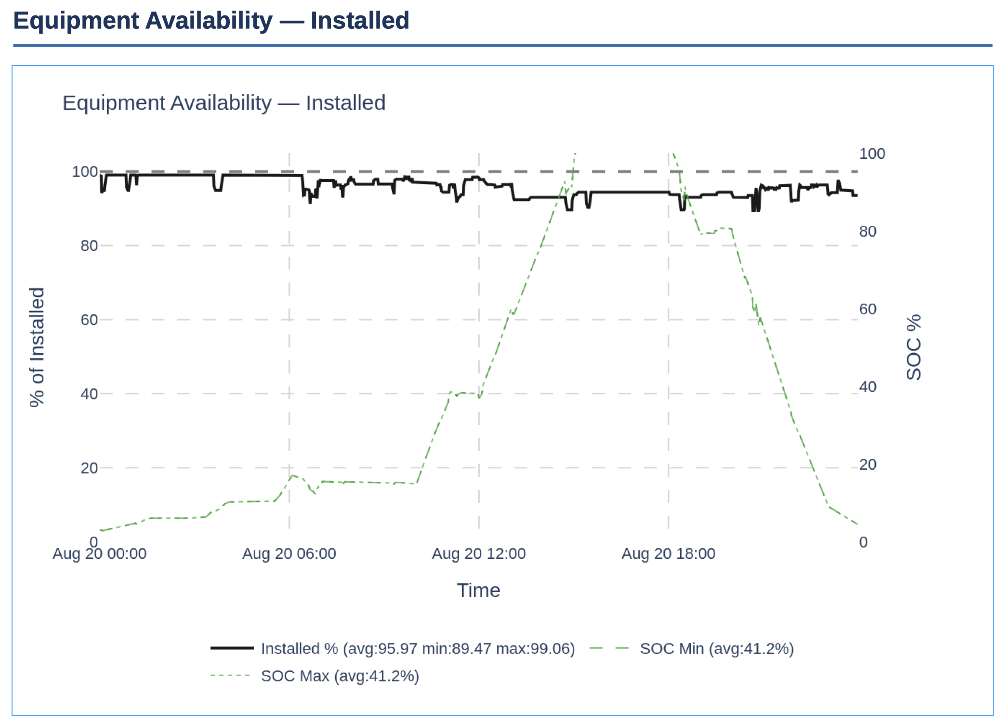
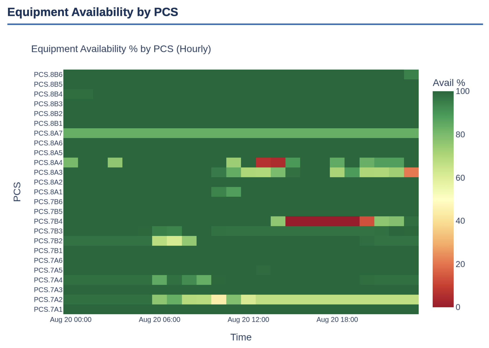
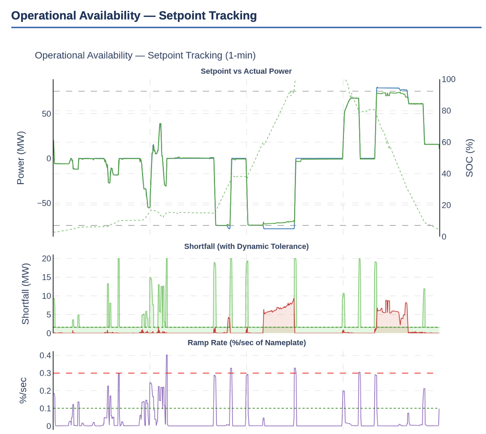
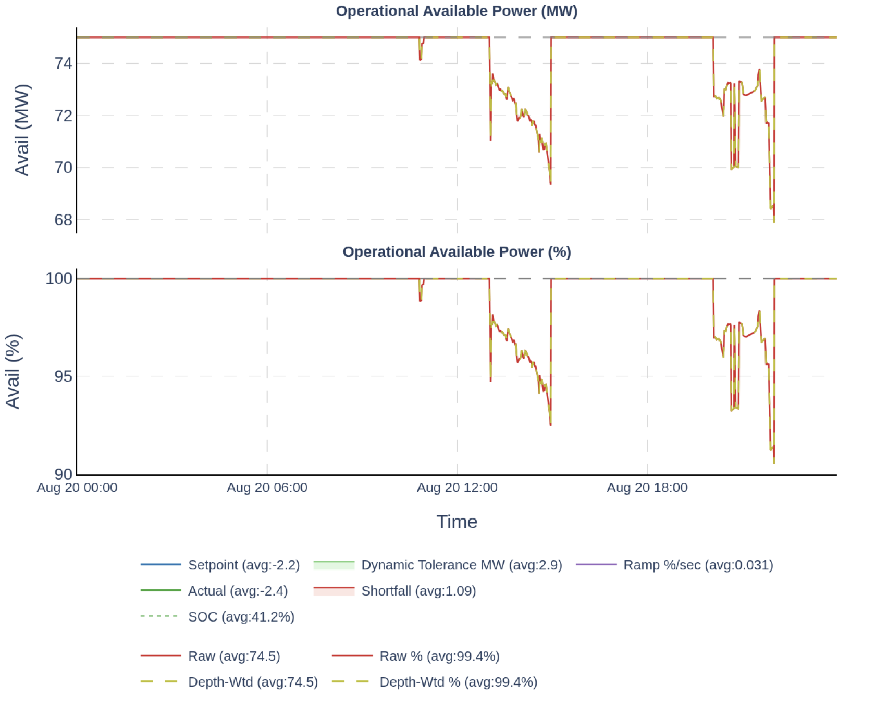
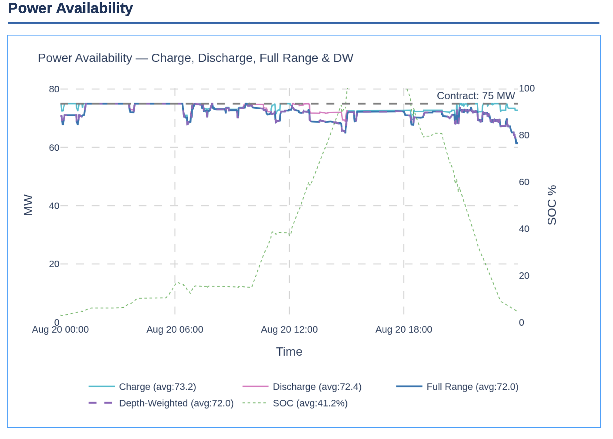
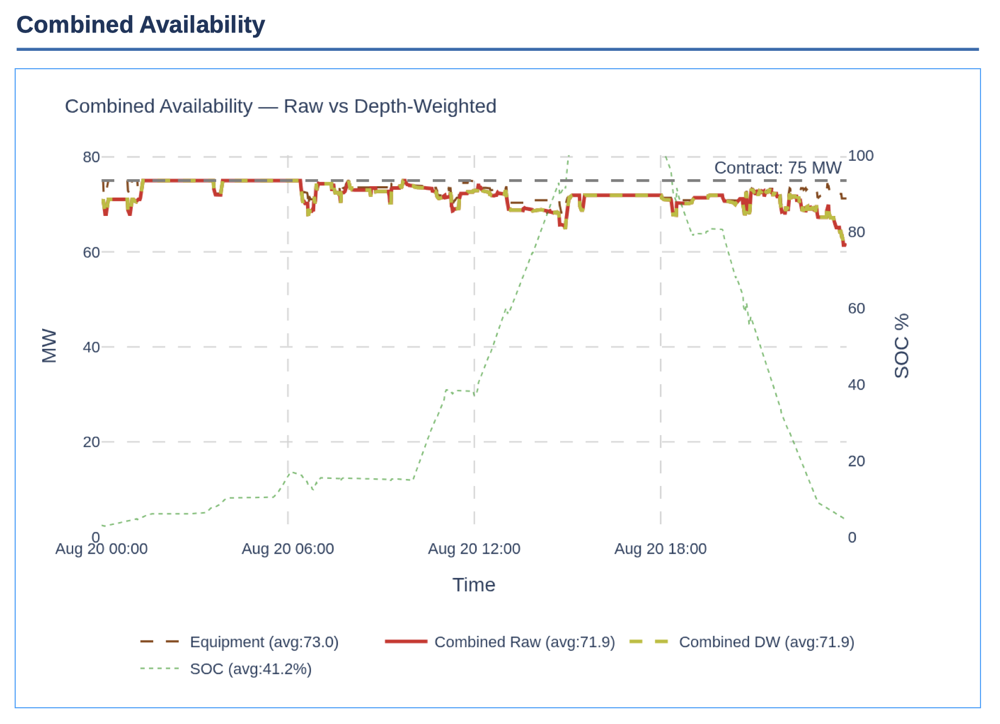

# Daily Performance Report

**Project:** `{{PROJECT_NAME}}`  **Market/ISO:** `{{ISO}}`  **Version:** `{{VERSION}}`  **Last updated:** `{{DATE}}`
**Source EIM version:** `{{EIM_VERSION}}` · **Companions:** [Outage Tracker](/Data_Product%28DP%29/Outage_Tracker/outage-tracker.md) (event ledger) · [PGM](/Performance_Guarantee_Matrix%28PGM%29/performance-guarantee-matrix.md) (the contractual calculations) · [Metrics Tree](/Metrics_Tree%28MT%29/metrics-tree.md) (formulas)

> **Scope note.** This document describes the target structure and build method for the daily report. **§2 is the engineering measurement**, the OBE framework: four availability types, computed the same way on every project, owing nothing to any contract. It is the starting point a project should adopt rather than a menu to choose from. **§3 is the offtaker's contractual view**, which is whatever the executed agreement says and is transcribed rather than modelled. **§4 is the service provider's view**, where §2's power availability definition is also the calculation the owner should negotiate into the agreement. Fill the contractual sections from the project's own [PGM calculation sheets](/Performance_Guarantee_Matrix%28PGM%29/calculations/index.md). Contractual numbers are generally not derivable from one another, nor from §2, and the report should say so rather than reconcile them away.

The daily report is the operational counterpart to the [Monthly Performance Report](../Monthly_Performance_Report/index.md): where the monthly pack explains and settles, the daily report answers *what happened yesterday, why, and what to do today*.

## Objective

Provide every operational stakeholder (field technicians, asset managers, O&M teams) with an automated snapshot of the last 24 hours from a **pure equipment point of view**, paired with the contractual perspectives that govern the project. It is designed to be reviewed in a daily stand-up: open the report, scan the headline numbers, click through to linked dashboards if a number warrants investigation, and use the guidance to prioritise today's work.

The report is **automated, reproducible, and versioned**. A human analyst can also regenerate it on demand for a historical date, or debug it interactively.

## Audience

| Role | How they use the report |
|---|---|
| Field technicians | Identify units or strings that need inspection today |
| Asset managers | Compare equipment health against the contractual positions |
| O&M teams | Prioritise work orders and vendor escalations using the fault summary and Plan of Day |
| Performance engineers | Spot trends and feed findings into the monthly pack and anomaly models |

## How to build it (recommended architecture)

### Data sources

| Layer | Technology | Purpose |
|---|---|---|
| Time-series plant data | ClickHouse, TimescaleDB, or InfluxDB | Telemetry, power, SOC, setpoints, unit-level signals |
| Outage & event records | PostgreSQL or MySQL (OLTP) | [Outage Tracker](/Data_Product%28DP%29/Outage_Tracker/outage-tracker.md) events, OMS tickets, CMMS work orders |
| Agentic insights | Pre-computed results from earlier batch jobs | Anomaly detection, performance engineering analysis, generated recommendations |

### Build method

A **Python notebook** is the recommended build vehicle. Marimo is preferred (reactive, debuggable, runs stand-alone on demand); Jupyter is acceptable if the team already uses it. The notebook executes a sequence of queries against the time-series database, joins outage data from the OLTP store, pulls pre-computed insights, and renders the report.

> **Orchestration note.** Agentic analyses (anomaly detection, performance engineering, Plan-of-Day generation) are scheduled to complete **before** the daily report job runs. The report pulls their results; it does not compute them inline.

### Outputs

1. **Computed daily KPIs** optionally written back to the time-series database so they can be trended and audited.
2. **Human-readable reports** in HTML and PDF, suitable for email distribution. Build the render template from whatever the notebook actually emits, and keep it beside this document once it stabilises. Constraints worth designing to from the start: inline styles and a table-based layout survive email clients, and charts embedded as base64 PNGs survive both email and headless-Chromium PDF export.
3. **Stored artifacts** in object storage or a report data store, for retrieval and versioning.

---

## Report sections

**Three views, and only one of them is engineering.** §2 is the plant as it physically behaved, measured the way any BESS should be measured. It is the same for every project, it owes nothing to any contract, and it is the view this report treats as correct. §3 and §4 are **contractual constructs**, each drafted by a party with an interest: an offtake or tolling agreement tends to be owner-friendly, a service agreement tends to be contractor-friendly. They are reported because they drive money, not because they describe the plant. Where a contractual definition disagrees with §2, that is a finding about the contract, not an error in the measurement.

The order matters: **build §2 first and completely**, then map the contracts onto it. A project that starts from its contract definitions ends up with numbers it cannot explain and no view of the plant at all.

> **On the screenshots.** The panels below come from a worked implementation on a fictionalized dataset. They show the intended shape, not any project's numbers.

### 1. Header / Executive Summary

Site, reporting day and timezone, contract and installed MW, unit count, generation timestamp, generator version, and a one-line health summary. The same report format should work for weekly or monthly.


#### 1.1 Operating Summary data

| Quantity | Definition | Watch out |
|---|---|---|
| **Total Charge** | Energy into the battery over the reporting day (MWh) | Boundary-dependent: revenue meter vs inverter terminals moves it by transformer and auxiliary losses. Feeds both RTE and EFC, so fix one boundary and use it for all three |
| **Total Discharge** | Energy out of the battery over the reporting day (MWh) | Same boundary caveat. RTE is discharge ÷ charge, so any boundary mismatch between the two surfaces as an efficiency error rather than a metering error |
| **EFC / Equivalent Full Cycles** | Throughput expressed in whole-capacity cycles | Must use the same convention as the service agreement's guarantee; see [definitions](/Definitions%28DEF%29/definitions.md). Cumulative EFC is commonly what terminates an energy-retention guarantee, so record the contract's threshold and trend against it |
| **Cycles / day** | EFC accrued in the reporting day | Offtake agreements commonly cap cycles per day and per year. Record both limits and show headroom |
| **RTE (Raw)** | Discharge ÷ charge over the raw day window | Meaningless when the day is not SOC-neutral |
| **RTE (SOC Matched)** | Same ratio over a window trimmed to equal start/end SOC | The defensible figure. Report **both**: they diverge sharply on a partial-cycle day. Below one full cycle, suppress it rather than print it: show `N/A` with the throughput that disqualified it (e.g. `Throughput 58% < 100%`) |
| **Avg SOC** | Mean state of charge across the day | Context for depth-weighting and for foldback-driven power shortfalls |
| **Total Minutes** | Minutes in the reporting day; the denominator for availability and completeness | 1,440 on a normal day, but **1,380 and 1,500 on the two DST transition days** in a market that observes it. A hard-coded 1,440 silently corrupts those two days a year |
| **Excused Minutes** | Minutes credited under an exclusion | A contractual verdict, not an observation. Must agree with the [Outage Tracker](/Data_Product%28DP%29/Outage_Tracker/outage-tracker.md) event ledger |
| **Data Completeness** | Intervals with valid data ÷ intervals expected, excluding excused | Report **per unit**, not just site-level. A site at 100% can hide a fleet at 80% |

#### 1.2 Operating Summary panel



#### 1.3 KPI Executive Summary panel



### 2. The four availability types (OBE)

Manufacturing measures a line with **OEE**, Overall Equipment Effectiveness: is the machine on, is it running at full speed, is it making good parts. A battery needs the same idea with its own questions, because "available" on a BESS can mean four different things that fail independently. Call it **OBE, Overall Battery Effectiveness**.

| Type | The question it answers | Primary unit | Secondary unit |
|---|---|---|---|
| **Equipment Availability (EA)** | Is the BESS on? | % | MW installed, MW contracted |
| **Operational Availability (OA)** | Is it responding to dispatch? | MW | % contracted |
| **Power Availability (PA)** | Can it deliver full power right now? | MW | % installed, % contracted |
| **Energy Capacity (QA)** | Does it still hold the capacity promised? | MWh | % installed, % contracted |

Each is strong where the others are blind, which is the whole argument for computing all four rather than picking one:

| Type | Granularity | Coverage | Accuracy | Blind spots |
|---|---|---|---|---|
| Equipment | Medium (on/off) | **High**, 100% of calendar time | **High**, from equipment status signals | **High**: imbalance, SOC error, derates are all invisible |
| Operational | **High** (MW) | **Low**, only during dispatch | **High**, meter measurement vs setpoint | **High**: every hour the dispatch command sits below nameplate |
| Power | **High** (MW) | **High**, 100% of calendar time | Medium, computed by the EMS from equipment-reported metrics | Medium: corner cases that are hard to model, such as reactive-power and temperature derating |
| Energy | **High** (MWh) | Medium: applies continuously, but only updates at a capacity test | **High**, measured by a controlled test rather than estimated | Medium: capacity tests are run in best-case operating conditions |

Equipment availability covers all the time but says only on or off. Operational availability is the most trustworthy number available, because it compares a meter against a setpoint, but it only exists while the plant is being dispatched. Power availability fills that gap with full calendar coverage at the cost of trusting an EMS estimate. Energy capacity is the odd one out: high accuracy because it is measured by a controlled test, low frequency for the same reason. No single one of them is the answer.

#### The combination

```
OBE = (1 / N) × Σ_i min( EA(i), OA(i), PA(i), QA(i) )
```

The average, across intervals, of the **minimum** availability recorded in each interval. A minimum rather than a product or an average, because these are not independent failure modes: they are four ways the same interval can fail to serve the contract, and the weakest one sets the ceiling at every point in time. Averaging would let healthy equipment mask a dispatch failure.

Three of the four are interval series. `QA` is a **scalar** that holds its value across every interval until a new capacity test is run or the guaranteed value changes, for the reasons in §2.4.



#### Capacity basis: installed, contracted, and the overbuild between them

Every availability number needs a denominator, and there are always two.

- **Contracted capacity** is what the offtake agreement requires, for example 100 MW / 200 MWh.
- **Installed capacity** is what was actually built, which is deliberately larger, for example 110 MW / 220 MWh. The difference is the **overbuild**.

The overbuild is what absorbs unit outages before the contract position is touched. Report against both denominators and watch the gap: an availability figure that looks healthy against contract while falling against installed means the margin is being consumed, which is the earliest warning of a degradation or reliability problem. How the two converge over time depends on the augmentation regime, since a fixed-energy-capacity contract holds the contracted line flat while installed decays toward it, and a variable-capacity contract lets both decay.

**Normalise every device capacity to the point of interconnection before summing anything.** A string rated in DC MWh and a PCS module rated in AC MVA cannot be added together, and neither is worth what it says at the POI. Three conversions to state explicitly and reuse everywhere:

- **Start from the PCS apparent-power rating, not its active-power label.** A 4.5 MVA PCS may only be usable for 4 MW of active power once reactive-power obligations and AC line-voltage headroom are honoured.
- **Apply conversion and POI losses directionally.** Losses reduce discharge and *help* charge, so a module at 4 MW with 2% loss to the POI is worth `4 × (1 − 0.02)` discharging and `4 × (1 + 0.02)` charging. Carrying one loss figure for both directions is a common and silent error.
- **Convert string energy to string power through the C-rate the system can actually sustain**, which is often above the nominal rate implied by the contract duration. A 4-hour system at a nominal 0.25C may be permitted 0.3C, and that headroom is exactly what lets a partially available plant compensate and rebalance.

#### 2.1 Equipment Availability: is the BESS on?

Built bottom-up from status signals, because that is the only thing this measure trusts.

**String level.** Two signals, and the weaker governs:

```
String_Avail = min( DC contactor status [open, closed], BMS availability status [0%, 100%] )
```

Use the string and bus voltage measurements as a **quality control** on those signals rather than as an input: with the contactor reported closed, `abs(string voltage − bus voltage)` should be under about a volt. A larger gap means a signal is lying, and it is worth catching before it becomes a monthly number.

**PCS level.** The same pattern, one layer up:

```
PCS_Module_Avail = min( module status [ready, run vs stopped, faulted, off], module availability [0%, 50%, 100%] )
```

Cross-check with `abs(PCS AC voltage − module AC voltage)` and `abs(DC bus voltage − module DC voltage)` for the same reason.

**Bus level.** A DC bus is a series chain, so it is worth the weaker of its battery side and its conversion side:

```
Avail_Bus_MW(bus, i) = min( Σ Avail_String_MW(bus, string, i), Σ Avail_PCS_Module_MW(bus, i) )
                       if data is available, else 0
```

Defaulting a data gap to zero rather than to the last known value is deliberate. An unproven interval is not an available interval, and the excused-events term below is where a genuine telemetry outage gets its credit back.

**BESS level, per interval and per evaluation period:**

```
Avail_BESS_MW(i)  = Σ_bus Avail_Bus_MW(bus, i) + Excused_MW(i)

Avail_Installed_%(i)  = Avail_BESS_MW(i) / Installed_Capacity_MW          -- must never exceed 100%
Avail_Contracted_%(i) = min( Avail_BESS_MW(i) / Contracted_Capacity_MW, 200% )

Avail_BESS_MW(ep) = Σ_i Avail_BESS_MW(i) / N
```

`Excused_MW` carries excused events quantified in MW per interval: scheduled maintenance, grid outages, and data loss during periods of known-good availability. `i` is the calculation interval, typically 1 to 5 minutes; `ep` is the evaluation period, from a day to a year; `N` is the number of intervals in it. **Capping convention:** the installed view is not clipped: it cannot legitimately exceed 100%, so a value above 100% is a denominator error to alert on, never to hide. The contracted view is capped at **200%** of contracted capacity; the 100–200% band is the visible fleet headroom (overbuild) absorbing unit outages before the contract position is touched, and clipping it at 100% would hide exactly the margin-consumption signal §3 says to watch.



A per-unit hourly heatmap is what turns a headline number into a work order. A red column is an event; a red row is a chronic offender.



#### 2.2 Operational Availability: is it responding to dispatch?

The most defensible measure in the set, because it compares a revenue-grade meter against the instruction that was actually sent. Its weakness is coverage: it says nothing during the many hours when the setpoint sits below nameplate or the plant is idle.

**Shortfall.**

```
Shortfall = max( 0, |setpoint| − |actual| )
```

Under-delivery only. Over-delivery is always zero, never a credit.

**Dead-band.** A configurable MW tolerance below which shortfall is not penalised, because no control loop tracks perfectly. The dead-band is then **widened in proportion to ramp rate**, since a plant cannot be faulted for lag it was ordered into:

```
ramp_rate = rolling max over the previous 2 intervals of min( |Δsetpoint|, |Δactual| ),
            expressed as % of contract MW per second
```

Taking the **minimum** of the setpoint change and the actual change is the subtle part: it widens the band only for ramps the plant genuinely attempted, not for a step command it ignored outright.

**From shortfall to availability.** For every interval where shortfall exceeds the dead-band and SOC is not the cause, the actual output *is* the available power. If 100 MW is requested and 90 MW delivered, the BESS is deemed 90 MW available.

> **The SOC exclusion is directional, and this is the rule most implementations get wrong.** A shortfall is excused only when the battery has hit a physical limit **in the same direction as the request**:
>
> - SOC at 100% and the setpoint is **charging**: excused, deemed fully available.
> - SOC at 0% and the setpoint is **discharging**: excused, deemed fully available.
>
> If the directions oppose, an empty battery asked to charge or a full battery asked to discharge, the shortfall counts **fully** against availability. Nothing physical prevented it. A non-directional SOC exclusion forgives exactly the failures that matter most.





#### 2.3 Power Availability: can it deliver full power right now?

The measure that fills operational availability's coverage gap: it applies across 100% of calendar time, dispatched or not. It is an EMS estimate rather than a measurement, so it carries more modelling risk and deserves deliberate validation.

Power availability is **two numbers before it is one**, and keeping them separate to the last possible step is what makes the measure honest:

- **ACP**, available charge power
- **ADP**, available discharge power

**String level.** Computed by the BMS from min and max cell voltage, current limit, and SOC. Best computed by a master BMS at the DC bus level rather than by each string BMS independently, so that one view of the bus governs. The SOC boundary conditions are absolute:

```
if SOC = 100%:  ACP = 0        (a full battery cannot charge)
if SOC = 0%:    ADP = 0        (an empty battery cannot discharge)
```

**PCS module level.** Computed by the PCS from its temperature derate curve, voltage limits, bus power balancing, and reactive-power priority, and it should already include conversion and POI efficiency so the number is meaningful at the interconnection.

**Bus level.** Replace X with Charge or Discharge throughout:

```
Bus_AXP = min( min(String_AXP) × number of connected strings, PCS_Module_AXP )
```

Note the inner term: the **weakest** string multiplied by the count, not the sum of the strings. Strings on a common DC bus are voltage-locked, so the weakest one sets what the bus can sustain. Summing them overstates capability, which is the most common modelling error in a power-availability implementation and it always errs in the owner's disfavour later.

**BESS level:**

```
PCS_AXP  = Σ Bus_AXP
BESS_AXP = min( Σ PCS_AXP, Contracted_Power )
```

**Combining the two directions into one number.** This is the definition to adopt, and the one to write into contracts:

```
BESS_AP = BESS_ADP                      if BESS_SOC = 100%
        = BESS_ACP                      if BESS_SOC = 0%
        = min( BESS_ADP, BESS_ACP )     otherwise
```

**The minimum of charge and discharge, except at the SOC rails where only one direction is physically meaningful.** Away from the rails, a plant that can discharge but can no longer charge is not fully available: it cannot take the next instruction, whichever way it comes. Taking the minimum is what makes a one-sided derate visible.

> ⚠️ **`max(charge, discharge)` is the formulation to refuse.** Some service agreements define available power as the *maximum* of the two directions. Under that rule a unit that has lost all discharge capability while charge capability is intact scores fully available, and one-sided derates become structurally invisible for the life of the contract. The rail-aware minimum above achieves the same thing the max rule is usually claimed to achieve, which is not penalising a full or empty battery, without blinding the measure everywhere else.

**What actually derates available power**, and therefore what the daily report should be able to attribute a drop to:

| Cause | Mechanism |
|---|---|
| Equipment unavailability | Units off directly reduce capability. Overlaps equipment availability but is not a substitute for it: the nominal capacity differs |
| SOC imbalance | Some strings hit full or empty before others, limiting what the whole DC bus can sustain |
| BMS current limiting | Temperature, cell balancing, and other BMS limits restrict deliverable current |
| PCS temperature | Ambient-temperature derate curves reduce PCS output |
| PCS AC voltage | DC-to-AC conversion needs a voltage ratio to reach full power |
| PCS reactive power | Apparent-power limits and reactive-power priority reduce available active power |



**Corner cases to settle before the first report**, each of which will otherwise be discovered in an argument:

- **Accuracy testing.** Run controlled tests with forced imbalance or imposed PCS power limits to validate the ACP and ADP values the BMS and PCS report. An unvalidated estimate is not evidence.
- **Idle and standby modes.** Walk every PCS operating mode and decide what power availability means in each. Standby is not obviously available or unavailable, and the choice must be written down.
- **SOC estimation error at the rails.** High and low SOC is exactly where the estimate is worst. A depth-weighted derate is the usual treatment.
- **SOC override for balancing.** Where the reported BESS SOC is deliberately biased to force continued charging or discharging for balancing, the availability calculation must know, or it will read the bias as a fault.

#### 2.4 Energy Capacity: does it still hold the capacity promised?

The odd one out, and the one most often implemented wrongly. The other three are interval metrics computed from streamed telemetry. This one is neither, and trying to make it one is the mistake.

**Energy capacity is a slow-moving signal.** It changes over months and years, not minutes and hours. Every fast energy effect worth capturing is already captured elsewhere:

| Fast effect | Already captured by |
|---|---|
| A string or unit offline | Equipment availability |
| Power derate from SOC imbalance | Power availability |
| Setpoint shortfall caused by reduced capability | Operational availability |

A single offline string does not reduce site energy capacity, because power rebalancing recovers it within minutes. Layering an interval-by-interval energy term on top of the other three **double-counts what they already see**, and it is the most common way an OBE implementation goes wrong.

**The one dimension nothing else captures is long-term capacity retention**: the slow, permanent fade that no rebalance can fix. It cannot be measured in real time. Only a controlled capacity test gives a reliable number, which is why this is the one availability type with high accuracy and low update frequency rather than the reverse.

```
QA = min( Q_test / Q_guaranteed × 100, 100 ) %
```

- `Q_test`: energy capacity measured in the most recent controlled capacity test (MWh). What the plant actually delivered under test conditions.
- `Q_guaranteed`: the contracted or guaranteed energy capacity (MWh) for the current year. Usually steps down annually on a schedule set in the agreement.

**QA enters OBE as a scalar, not as an interval series.** It holds its value until a new capacity test is performed or the guaranteed value changes. That is correct behaviour rather than a limitation: it applies a retention correction reflecting what the asset can truly deliver over a full cycle, without claiming a resolution the measurement does not have.

**Read the test trace, not just its headline number.** A capacity test runs in best-case operating conditions, which is its blind spot: the result is an upper bound on what the plant will do on a bad day. Two features worth capturing every time:

- **The discharge power taper** at the end of the test, where SOC divergence between strings forces a derate before the nominal energy is delivered. The area lost under that taper is **imbalance, not degradation**, and booking it as degradation writes off capacity that is actually recoverable.
- **Charge energy that is not usable**, where the charge taper means the last increment went in but will not come back out at rated power.

Track the test history against the guarantee schedule, including tests that failed, guaranteed-level changes, and re-tests that passed. A re-test pass after a failure is a materially different contractual position from never having failed, and only the history shows it. The test itself is usually a guaranteed capacity test under the [PGM](/Performance_Guarantee_Matrix%28PGM%29/performance-guarantee-matrix.md), so its protocol, preconditions and remedies belong in the calc sheet rather than here.

**SOC needs a declared basis before any of this is comparable.** Installed SOC runs 0 to installed MWh; contracted SOC runs 0 to contracted MWh, and the buffers between them mean a plant reporting 100% contracted SOC may be at 95% installed SOC with batteries that are not actually full. Percentages hide this and MWh does not, so state which basis every SOC figure uses, and prefer MWh wherever a number will be compared across systems.

#### 2.5 Raw vs depth-weighted

**Raw** applies no forgiveness. **Depth-weighted** reduces the penalty for shortfalls at extreme SOC, where limited deliverability is physics rather than a fault:

```
weight(i) = (SOC(i) / threshold) ^ exponent      when SOC(i) < threshold on discharge
                                                 (mirrored above the upper threshold on charge)
```

Equipment rows carry **no** depth-weighted value: forgiveness applies to power delivery, not to whether a unit is in service. Publish the curve parameters or the number is unreproducible.

> ⚠️ **Depth weighting is load-bearing, not a refinement.** Because power availability takes the minimum of the two directions away from the rails, and because SOC estimation error is worst exactly at the rails, a plant parked near full or empty will read low raw and drag OBE with it. Until the threshold and exponent are set, publish the raw figure with SOC context beside it and do not headline the combined number.



### 3. Offtaker View (external / grid)

The offtaker's position under the tolling agreement or PPA, reported beside the engineering view in §2: availability and deviations against the contractual number, plus any grid-side or dispatch constraint that affected performance.

**The definition is not written here.** Offtake availability definitions vary widely in mechanism, denominator, excused treatment, and who computes the binding number, so the project's own is transcribed once into its [PGM calculation sheet](/Performance_Guarantee_Matrix%28PGM%29/calculations/index.md) and the report emits from there. Where the agreement is silent on method, the [PGM reference position](/Performance_Guarantee_Matrix%28PGM%29/performance-guarantee-matrix.md) supplies the default and the sheet cites it.

Two properties of that definition decide what this section can show, so establish them before building anything:

- **Does the formula read the outage log or telemetry?** A formula built from logged outage hours has no meter input anywhere in it, so an unlogged derate is invisible to the contractual number and log discipline becomes the real control. Against a log-based definition this section's job is **reconciliation**, not measurement. A telemetry-based definition can be shadowed directly.
- **Does it measure power only, or power and duration?** Power-only definitions score a plant with ten minutes of energy behind it as fully available. Where the agreement is silent on the energy dimension, say so in the report rather than letting the silence read as coverage.

**What the report shows:**

- Yesterday's contractual figure beside the §2 engineering figure, with the gap **explained rather than reconciled away**. The gap is the finding.
- Running contract-year accumulators in whatever units the formula uses.
- Remaining excused or planned-outage budget against any cap, as a burn-down rather than a percentage. At a 98% guarantee the annual budget is only about 175 equivalent full-outage hours, which reads very differently as a countdown.
- The **With Excused @ 100%** and **Without Excused** pair. The first credits excused minutes at contract MW, the counterparty's view once exclusions apply; the second grants no credit, the physical truth. The gap between them *is* the value of the exclusions being claimed, and a report showing one side only is an argument rather than a record.

Excused treatment is the part of an offtake definition most likely to differ from what an engineer expects, and the full cross-contract comparison lives in [PGM §5](/Performance_Guarantee_Matrix%28PGM%29/performance-guarantee-matrix.md). The one thing to surface daily is any outage **logged as planned whose notice record is short or missing**, because notice is usually what creates the exclusion and a missed notice silently converts the event to forced.

### 4. Service Provider View

The service agreement covers the batteries, the conversion equipment, and usually the site controller, which means the provider owns both the plant's **capability** to deliver power and its **ability to act on an instruction**. Nearly every agreement measures only the first.

This section reports the provider's KPIs verbatim so they can be compared against §2. The calculation the owner should be **negotiating into** the agreement, and the arguments for it, live in the [PGM reference position](/Performance_Guarantee_Matrix%28PGM%29/performance-guarantee-matrix.md); where the executed definition differs from it, report both numbers and let the difference stand.

#### 4.1 Shadowing the provider's power availability

Compute an owner-side replica of the provider's own definition, whatever it is, from owner-held signals. That replica is the only thing that makes the annual report contestable.

**What the report shows:**

- The owner-side replica beside the provider's published figure, and beside §2's power availability computed the correct way. Where the agreement uses `max(charge, discharge)`, expect the provider's number to read higher and the divergence to be concentrated in one-sided derates.
- **Valid-interval count per hour**, flagging the hours at risk of dropping out of the denominator entirely.
- Running consumption of the planned-outage allowance, and projected year-end availability.

> ⚠️ **A self-graded exam is not a guarantee.** Where the input is a provider-computed estimate, archived by the provider and assessed with no testing, the annual report cannot be contested at all. Owner-side capture of the same points at equal or better resolution is the precondition for everything in this section, and it must exist before the first operating year closes because it cannot be created retrospectively.

#### 4.2 Operational availability: the dimension usually missing

Where the agreement carries no response measure, shadow one anyway. It costs nothing beyond data already captured, it is the evidence base for arguing the provider's number overstates what the owner received, and it is the specification to table at the next amendment. It is seeded as an explicit gap row (PG_206) in the PGM for the same reason.

Use the §2.2 construction unchanged, including the directional SOC exclusion, so the owner's operational number and the provider-attributed one differ only in **attribution**, never in method. A difference in method turns every conversation into an argument about arithmetic instead of about cause.

```
Op_Avail_provider = (intervals responding correctly) / (intervals instructed, less excused)

An interval responds correctly when all of:
  1. the setpoint was received and acknowledged within the response time
  2. shortfall is inside the ramp-adjusted dead-band
  3. no controller fault, command timeout, or comms loss is active inside the provider's boundary
```

Attribution is the daily work, and the report should carry the split rather than a single number:

| Failure | Attributable to |
|---|---|
| Site controller fault, provider firmware defect, internal comms loss | Provider |
| Plant controller or EMS outside the provider's boundary | Owner or the controls integrator |
| Dispatch signal never arrived from the offtaker or ISO | Offtaker, and usually excused on both sides |
| Setpoint unachievable at the SOC rail, request in the same direction as the limit | Nobody, if capability was correctly declared |
| Setpoint unachievable but capability was declared available | **Provider.** A declaration problem is theirs as much as an availability problem |

That last row is where the two dimensions meet, and it is the one to instrument first. Capturing declared ACP and ADP alongside actual response turns "the plant did not do what it said it could" from an assertion into a finding.

**The gap between the two figures is the headline.** A provider at 99% power availability and 92% operational availability is telling you the equipment is fine and the controls are not, which is a different work order, a different escalation, and eventually a different contract.

#### 4.3 Building the excuse-event record

Excuse events reduce the provider's denominator, so excused power is not counted against them. The full list and its asymmetry against the offtake side belong in [PGM §5](/Performance_Guarantee_Matrix%28PGM%29/performance-guarantee-matrix.md); what the daily report owes is the **evidence**.

Every excuse-event row in the provider's annual report needs owner-side corroboration to contest: timestamps, cause, and MW effect from the owner's own event log. That counter-evidence only exists if it was captured daily, which is the reason this section sits in a daily report rather than an annual one.

> ⚠️ **The event that scores opposite ways.** A controller command timeout stops the system. It is typically **excused for the provider** as an owner-side cause while counting **fully against the owner** as a forced outage under the offtake agreement. One physical event, two contracts, opposite verdicts. Watchdog the command path and log it from the owner side, every day, whether or not anyone has asked for it yet.

### 5. Fault & Outage Insights

A narrative and tabular review of:

- **Fault summary**: count and category of faults logged in the last 24 hours.
- **Last 7 days of outages**: drawn from the [Outage Tracker](/Data_Product%28DP%29/Outage_Tracker/outage-tracker.md) and the OMS ticket register. Include events that **started before the reporting day** but overlap it, and carry the counterparty's own outage or ticket reference in the event name so each row can be reconciled against their system.

> **Realism note.** Because the report is automated, an outage that started yesterday may not yet be recorded in the outage tracker. Showing the trailing seven days gives the daily stand-up enough context to notice patterns even when the most recent ticket lags by a day.

### 6. Plan of Day *(optional)*

Generated operational recommendations based on yesterday's data. For example:

> *"Inverter string `{{UNIT_ID}}` showed repeated communication faults. Recommend opening a ticket with the service provider and scheduling a field inspection before the next dispatch window."*

This section is produced by an agent that reads the report's own outputs and the pre-computed anomaly set. Marked optional because it depends on agent maturity and operator trust.

### 7. Anomaly Detection Insights *(optional)*

Performance-engineering findings from statistical or model-based analysis, for example SOC drift anomalies, capacity fade indicators, or RTE boundary effects. This section grows over time as new analyses are developed and scheduled.

### 8. Operator Links & Resources

A curated set of deep links to the portals and dashboards operators use daily: the [dashboard suite](../Dashboards/dashboards.md), the OMS web UI, the CMMS work-order queue, the settlement portal, and any counterparty availability portal. The report is the first screen an operator opens; from here they jump to the tool they need.

## 9. Reporting and calculation settings

Everything needed to reproduce the numbers. Without this block the report is an assertion. ❓ marks values still to be confirmed.

#### 9.1 Site & contract

| | |
|---|---|
| Contracted Power / Energy | `{{MW}}` / `{{MWh}}` |
| Installed Power / Energy | `{{MW}}` / `{{MWh}}` |
| Overbuild | `{{x}}`% energy, `{{x}}`% power |
| Energy capacity regime | fixed or variable contracted capacity; augmentation years `{{list}}` |
| PCS count / modules per PCS | `{{n}}` / `{{n}}` |
| DC bus count / strings per bus | `{{n}}` / `{{n}}` |
| Last tested RTE | `{{x}}%` on `{{DATE}}`, guaranteed `{{x}}%` |
| Last capacity test | `{{DATE}}`: `Q_test` = `{{MWh}}` against `Q_guaranteed` = `{{MWh}}`, so `QA` = `{{x}}`% |
| Capacity guarantee schedule | `{{step-down by contract year}}`, and the test history including any failures and re-tests |
| COD date | `{{DATE}}` (state which instrument defines it if several dates circulate) |
| Timezone | `{{TZ}}` |
| Measurement boundary | `{{meter and voltage level}}`, stated per metric |

#### 9.2 Capacity normalisation to the POI

The conversions behind every MW figure in §2. Publish them or none of the availability numbers can be reproduced.

| | |
|---|---|
| PCS apparent-power rating | `{{n}}` MVA, of which `{{n}}` MW usable active power |
| Reactive-power obligation | `{{describe}}` (reduces available active power) |
| PCS-to-POI loss | `{{x}}`% |
| DC-to-POI charge loss | `+{{x}}`% (losses **increase** available charge power) |
| DC-to-POI discharge loss | `−{{x}}`% |
| Nominal C-rate | `{{n}}` C (from contract duration) |
| Maximum sustained C-rate | `{{n}}` C (headroom that permits rebalancing and partial-availability compensation) |

#### 9.3 Calculation intervals

| | |
|---|---|
| Calculation interval | `{{1 to 5}}` min |
| Minimum valid intervals per hour | `{{n}}` (below this the hour is `{{dropped / counted unavailable}}`) |
| Data-gap default | unavailable (0), with genuine telemetry outages credited via excused events |
| Evaluation periods | day, month, contract year |

#### 9.4 Operational availability parameters

| | |
|---|---|
| Dead-band (stable) | `{{±x}}` MW |
| Dead-band (max, fully ramped) | `{{±x}}` MW |
| Ramp-rate basis | rolling max over previous `{{2}}` intervals of `min(|Δsetpoint|, |Δactual|)`, as % contract MW/sec |
| Response time | `{{n}}` s for setpoint acknowledgement |
| Contractual ramp-rate cap | `{{x}}`%/min, if any |

#### 9.5 Depth-weighted availability parameters

| | |
|---|---|
| Forgiveness threshold | `{{x}}`% SOC (discharge below `{{x}}`%, charge above `{{x}}`%) |
| Curve exponent | `{{n}}` (weight = (SOC / threshold)^`{{n}}`) |
| SOC basis | installed or contracted, stated explicitly |
| SOC override in use | yes/no (balancing bias that the calculation must know about) |

## Conventions to pin down before the first issue

- [ ] **Measurement boundary per metric.** Revenue meter vs plant controller vs OEM site controller. RTE is discharge ÷ charge, so the boundary moves it by the transformer and auxiliary losses.
- [ ] **POI normalisation constants.** PCS MVA vs usable MW, directional charge and discharge losses, and the sustained C-rate. Every MW in §2 depends on these.
- [ ] **Validate the EMS-reported ACP and ADP** with controlled tests using forced imbalance or imposed PCS limits, before the numbers are relied on contractually.
- [ ] **PCS idle and standby modes**, and what power availability means in each.
- [ ] **SOC basis** (installed vs contracted) declared for every SOC figure, and whether any balancing override biases the reported value.
- [ ] **Which contractual definition each report metric proxies**, stated in the report itself, with the reminder that the contractual numbers are generally not derivable from one another.
- [ ] **Excused treatment.** What qualifies under each contract, who adjudicates, and how the verdict reaches the report from the event ledger.
- [ ] **EFC convention** matching the service agreement's guarantee.
- [ ] **Dead-band and ramp-rate parameters.** A judgement call that changes the result; publish it.
- [ ] **Depth-weighting curve**, or an explicit statement that no forgiveness is applied.
- [ ] **Day boundary** in the project timezone, verified across daylight-saving transitions, rolling up cleanly into contract-year totals.
- [ ] **Provisional vs final**, with a version and supersedes marker.
- [ ] **Emit from the [PGM](/Performance_Guarantee_Matrix%28PGM%29/performance-guarantee-matrix.md) and [Metrics Tree](/Metrics_Tree%28MT%29/metrics-tree.md) calculations.** Never recompute inside the report. A daily figure that disagrees with the monthly guarantee calculation is worse than no figure.
- [ ] **Agentic data pipeline.** Where pre-computed insights land and how the notebook reads them.
- [ ] **Notebook deployment.** Scheduled execution environment, secrets management for database credentials.
- [ ] **Distribution list** and report-store path.
- [ ] **Operator link registry.** Which URLs to include and how to keep them current.

## Open items

Tracked in this folder's `todo.md` (create it with the first item).
