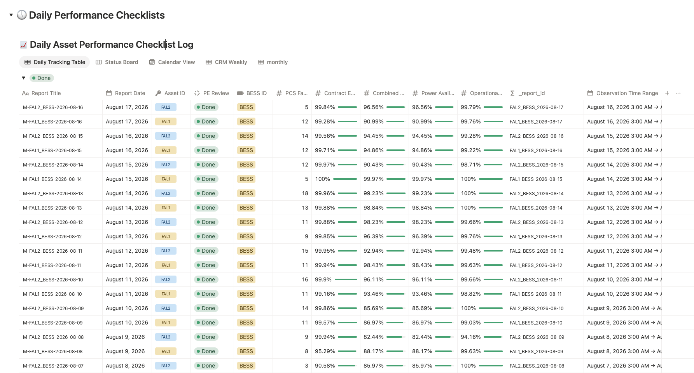
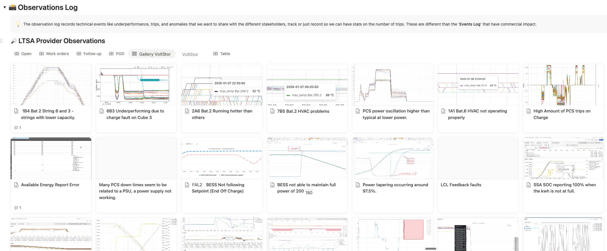
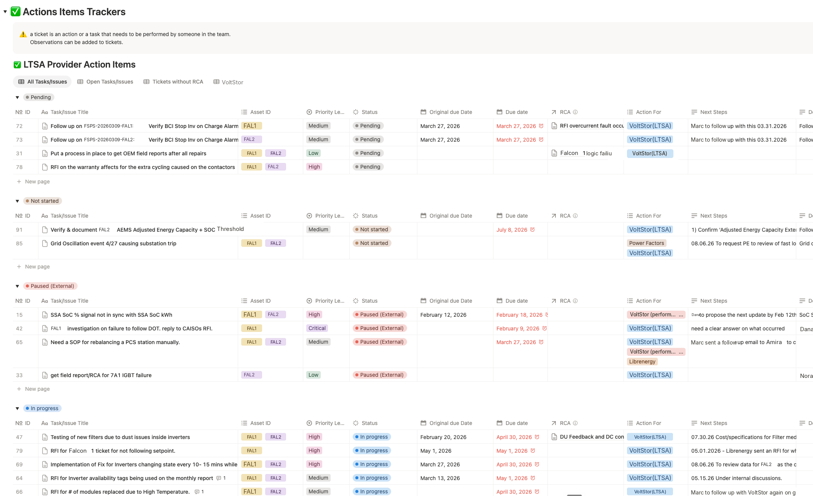
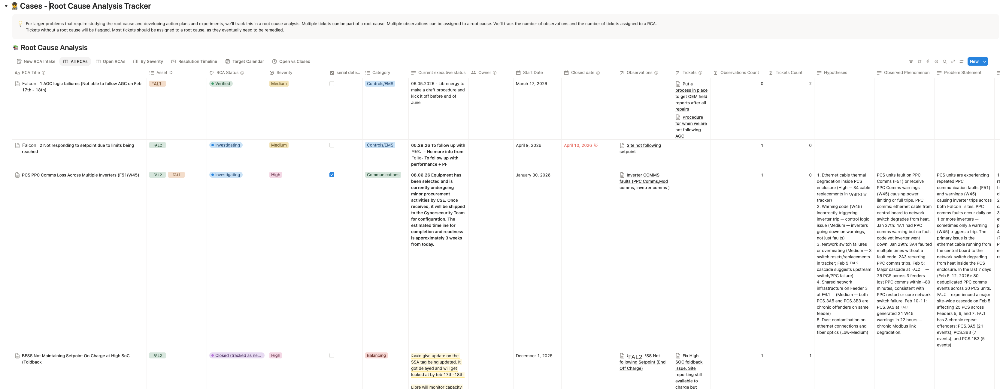
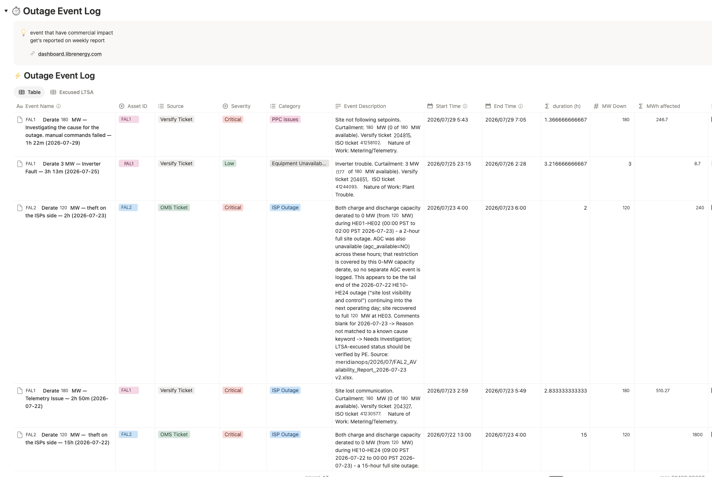
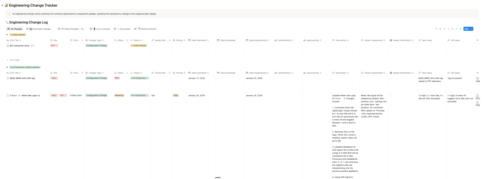

# Performance Engineering Management

**Version:** 0.2 (template) · **Status:** Draft

The project-management layer of performance engineering: the structure for tracking observations, action items, cases, outage events, engineering changes, and key documents on a shared platform. The aim: every day someone demonstrably checked the plant, everything odd got recorded, and everything recorded either went somewhere or was consciously closed.

This document is platform-agnostic. It lives under Data Products because its recurring outputs (the daily checklist, the weekly action review, the exclusions feed) are deliverables.

## 1. Repo and platform

| | This repository | The management platform |
|:---|:---|:---|
| Holds | Established fact and method: reviewed contracts, definitions, calculations, procedures | The living record: what happened today, who is doing what, what changed |
| Changes | Per document version, logged | Continuously, by the whole team |
| Audience | Performance engineers and agents | Team, counterparties (shared views), client |

The platform links to what the repo settles; it never restates it. The repo never tracks live work.

## 2. Platform

**Recommended: Notion.** Linked databases, filtered views, a page body on every record (an RCA record is its own wiki page), page templates, external sharing, and an API. Alternatives: Smartsheet, Salesforce, Dynamics 365, NocoBase.

Minimum requirements: relations between registers, status workflows, per-record discussion, externally shareable filtered views, and an API for automated entries.

## 3. The register set

| Register | Holds | Cadence |
|:---|:---|:---|
| [Daily performance review checklist](#4-daily-performance-review-checklist) | One checklist record per site per day: ratings, availability numbers, reviewer sign-off | Daily |
| [Observation log](#5-observation-log) | Anything odd, recorded even when no action follows | As seen |
| [Action item tracker](#6-action-item-tracker) | Tickets assigned to a party, with due dates | Weekly review |
| [Case tracker](#7-case-tracker) | Multi-step problems: RCAs, retrofits, process improvements | Per case |
| [Outage event log](#8-outage-event-log) | Commercially impactful events only: the exclusions feed | Per event |
| [Engineering change log](#9-engineering-change-log) | Every software, configuration, or hardware change, with approval | Per change |
| [Knowledge base](#10-knowledge-base) | Wiki (problems studied, RCA write-ups, how things work) plus the document register mapping the archive | As written |

**Not on the platform: contacts.** The [Contact Register](../../Contact_Register%28CR%29/contact-register.md) is the source of record. A read-only mirror or link is fine; a copy goes stale.

## 4. Daily performance review checklist

One record per site per day. The reporting stack generates the numbers; the record exists for the **check-off**: proof a person worked through the checklist and rated each dimension of plant health today.

| Field group | Fields |
|:---|:---|
| Identity | Date, site/asset, unit |
| Checklist ratings | One status per health dimension (battery operation, PCS operation, SoC balancing, power balancing, technical availability), each rated Critical / Poor / OK / Great |
| Numbers | Availability under each contractual definition, fault counts |
| Recommendations | Standing guidance maintained daily (SoC operating limits, calibration status) |
| Workflow | **Review status** (Pending → Ready for Review → Done), counts of observations and actions raised today |
| Notes | Free text; page body carries the day's full checklist from a template |



The checklist items come from the project's monitoring priorities and SOPs, settled once. Automate record creation from the monitoring stack; the human fills ratings and review status.

## 5. Observation log

Anything odd gets recorded, whether or not action follows: underperformance, trips, anomalies, a number that looks wrong. Half the value is statistical; trip counts only exist if the boring instances get recorded too.

| Field group | Fields |
|:---|:---|
| Identity | Auto-ID, title, date, observer |
| Location | Site, unit, device, matching the plant hierarchy |
| Classification | Category (fault families: over-temperature, PCS fault, battery fault, SoC imbalance, cell-voltage anomaly, availability/derating, HVAC, other), severity (Critical/High/Medium/Low), fault codes |
| Substance | Details, measured values (peak temperature, duration above threshold, event count), monitoring-chart link |
| Disposition | Status: `Open`, closed only as `Closed (submitted to counterparty)`, `Closed (turned into action item)`, `Closed (turned into case)`, or `Closed (no further action)` |
| Links | Action items, case, counterparty acknowledgement flag, shared-with |



**An observation never just disappears; its closure states where it went.** "No further action" is an explicit decision. Where a service provider works their own queue, split into a counterparty-facing register (shared view, acknowledgement tracked) and an internal one with the same schema.

## 6. Action item tracker

A ticket: something a specific party must do. A work order, a vendor ticket, an information request, or an internal task.

| Field group | Fields |
|:---|:---|
| Identity | Auto-ID, title, description |
| Assignment | Action for (party, by role: LTSA provider, O&M provider, EMS/PPC provider, owner, performance engineering), assigned person |
| Classification | Type (issue / task / investigation / improvement / reporting / documentation, plus domain tags), priority |
| Schedule | **Due date and original due date**: the pair records slip without losing the commitment |
| Workflow | Status: `Not started` / `Pending` / `In progress` / `Paused` / `Paused (external)` / `Done` / `Turned into case` |
| Dialogue | Response (theirs), next steps (ours) |
| Links | Source observations, case, engineering change; "mirrored in counterparty system" flag |



Reviewed at the weekly meeting: open items by due date, slipped items discussed, `Paused (external)` chased. Actions without a case get flagged periodically; recurring problems deserve one.

## 7. Case tracker

The broader problems: multi-step, hypothesis-driven mini-projects. A case collects observations and actions under a problem statement and an owner.

| Field group | Fields |
|:---|:---|
| Identity | Title, owner, severity, site |
| Classification | Type (root cause analysis / retrofit / process improvement / warranty claim), category, **serial-defect flag** for failures recurring across units (what a supply-agreement serial-defect clause will ask about) |
| Method | Trigger, problem statement, observed phenomenon, hypotheses, **verification criteria**: what must be demonstrated before closing |
| Workflow | Status: `Proposed` / `Back burner` / `Investigating` / `Experimenting` / `Implementing fix` / `Verified` / `Closed (won't fix)`; dates; **current executive status** (one line, kept current, feeds the reports) |
| Links | Observations, action items (with rollup counts), engineering changes, outage events explained by this case |



The page body is the working document, from a case template. A formal study produced by a case is a [work product](../../Work_Product%28WP%29/index.md) in this repo; the case links to it. Closed cases form the problem-history wiki (§10).

## 8. Outage event log

The most contractually important register. Only commercially impactful events enter: ISO-registered outages, scheduled maintenance, capacity tests, grid events, curtailments, telemetry losses. The test: will this need to be excluded from (or argued about in) a contractual calculation, or explain a commercial-vs-technical gap? Routine trips and imbalance stay in the observation log and the Outage Tracker ledger.

| Field group | Fields |
|:---|:---|
| Identity | Event name, description, site |
| Time and size | Start, end, duration (computed), MW down, MWh affected (computed), estimated cost |
| Classification | Category (grid event, planned/corrective maintenance, testing, software, SCADA/telemetry, setpoint deviation, operational error), severity |
| **Exclusion mapping** | **One checkbox per contract**: excused under the offtake agreement, excused under the LTSA (extend per contract), plus a **"should not be excused" dispute flag** for counterparty claims we intend to challenge |
| Provenance | Source (ISO outage ticket, counterparty report, monitoring platform, manual) with external reference |
| Cause | Root cause (one line), case link |



Two standing purposes: the **excluded-events feed** (monthly availability and settlement calculations read exclusions from here, one register serving every contract via the per-contract flags) and **commercial-vs-technical reconciliation** (when revenue underperforms while availability looks fine, the explanation should already be a row here). Events cross-reference [Outage Tracker](../Outage_Tracker/outage-tracker.md) ledger IDs where they overlap: the Outage Tracker holds every outage/derate, this log holds the commercial subset.

## 9. Engineering change log

Anything that changes the project from its original design: firmware and software deployments, configuration and parameter changes, hardware swaps. Runs the approval process where one exists; records what changed, when, and who knew regardless.

| Field group | Fields |
|:---|:---|
| Identity | ECN number, title, **plain-English summary**, why (one line) |
| Classification | Change type (software / configuration / hardware / design), affected system (PCS, BMS, EMS/SCADA, PPC, controls and protection, metering, network/IT, HVAC, fire suppression, BoP), scope, priority |
| Change record | **Old value → new value** for parameter and configuration changes; the change log is the history of every operating parameter |
| Approval | Submitted by/date; status `Proposed` → `Under review` → `Approved (awaiting rollout)` → `In production (current)` → `Closed (past version)`; approved by; scheduled and implemented dates |
| Lineage | **Supersedes / superseded by**: the chain answering "what version is running and what did it replace" |
| Links | Vendor reference, motivating case, implementing action items, impact assessment |



Two rules: a change is not `In production` until verified on the plant, and warranty-relevant changes cite the clause they touch. The owner-side conditions in the [Warranty Obligation Matrix](../../Warranty_Obligation_Matrix%28WOM%29/warranty-obligation-matrix.md), firmware control especially, are only defensible if this log shows who approved what, when.

## 10. Knowledge base

The per-project wiki plus the document register, in one place.

**Wiki:** problems studied, RCA write-ups, how-the-plant-actually-works pages. On Notion this is mostly free: case pages are wiki pages, and the knowledge base is the closed-case collection plus standalone pages for anything worth explaining once. Structure lightly; a top page with sections beats a folder tree nobody maintains.

**Document register:** key documents that are not repo content (capacity test reports, monthly reports, field service reports, warranty claims, vendor tickets) live in the project's document archive (SharePoint or equivalent). The register documents the structure: one entry per document type, with archive link, naming convention, owner, and cadence. The register is the map; the archive is the storage. Nobody should ask "where do capacity test reports go". The repo remains the library for reviewed context ([Project_Documentation](../../Project_Documentation/index.md)); the archive holds the operational document flow.

## 11. Linking model

```
Checklist ──raises──▶ Observation ──escalates──▶ Action item ──belongs to──▶ Case
                          │                          │                        │
                          └──────────── may attach directly ─────────────────┘
Outage event ──explained by──▶ Case ──produces──▶ Engineering change
                                   └──produces──▶ Work product (repo) / SOP (repo)
```

The discipline:

- **Record first, classify second.** An observation costs thirty seconds; a missing one costs a statistic.
- **Closures state destinations.** Every observation and action closes into something, or into an explicit "no further action".
- **Cases own the narrative.** Recurring observations and orphan actions get adopted by a case; the case's executive-status line is what reports read.
- **Changes close the loop.** A fix gets an ECN, and the case's verification criteria confirm it worked.

## 12. Cadences

| Cadence | Ritual | Registers |
|:---|:---|:---|
| Daily | Plant check: work the checklist, rate each dimension, raise observations and actions, set review status to Done | Checklist, observations |
| Weekly | Action review meeting; weekly tactical report from the registers | Actions, case statuses, events |
| Monthly | Management report; outage event log reconciled against availability and settlement calculations | All; feeds the [Monthly Performance Report](../Monthly_Performance_Report/monthly-performance-report.md) |
| Per event | Outage event logged within a day, contract flags set while facts are fresh | Outage event log |
| Per change | ECN before implementation where approval applies | Change log |

## 13. Counterparty portals

Shared filtered views of the registers: the LTSA provider sees their observation queue and action items; the client sees the portal top page, daily checklists, and case statuses. A share boundary is a view filter, not a separate copy: one source of truth, audience-scoped windows.

## 14. Setup sequence

1. Choose the platform (§2); create the portal top page.
2. Stand up the **daily performance review checklist** with its page template. The daily habit is the foundation.
3. Add the **observation log** and **action item tracker** with their relation; settle the category taxonomy and severity scale.
4. Add the **outage event log**, one excused-flag per contract, from the exclusion clauses in the [Performance Guarantee Matrix](../../Performance_Guarantee_Matrix%28PGM%29/performance-guarantee-matrix.md).
5. Add the **engineering change log**.
6. Add the **case tracker** with its page template.
7. Create the **knowledge base** top page with the document register.
8. Share the counterparty views; connect the monitoring stack's automated entries.
