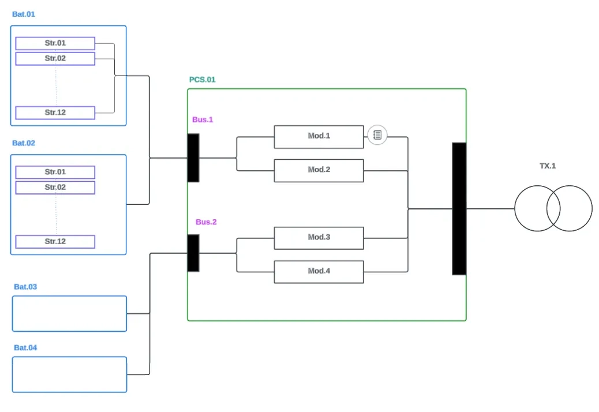
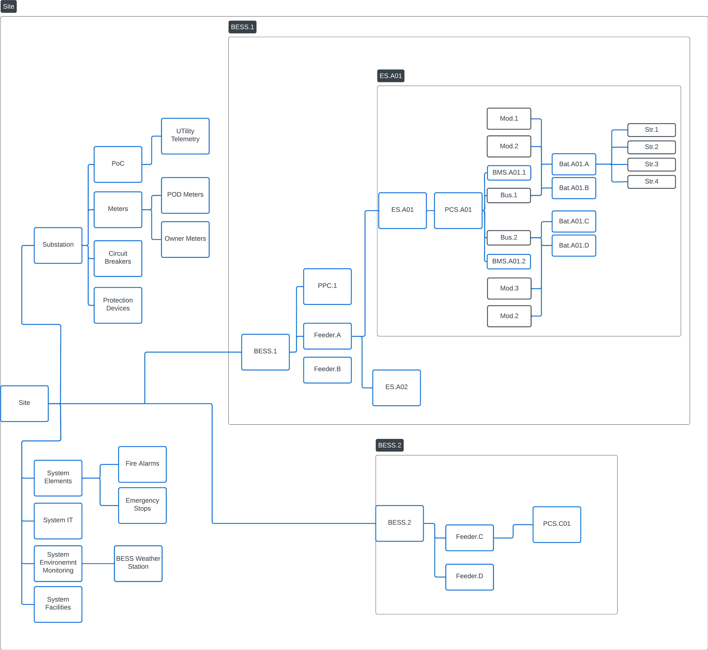
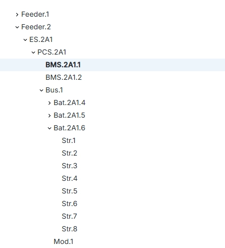
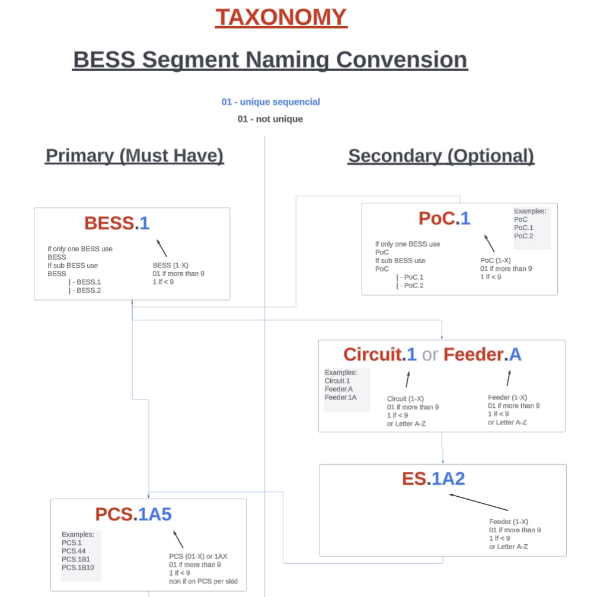
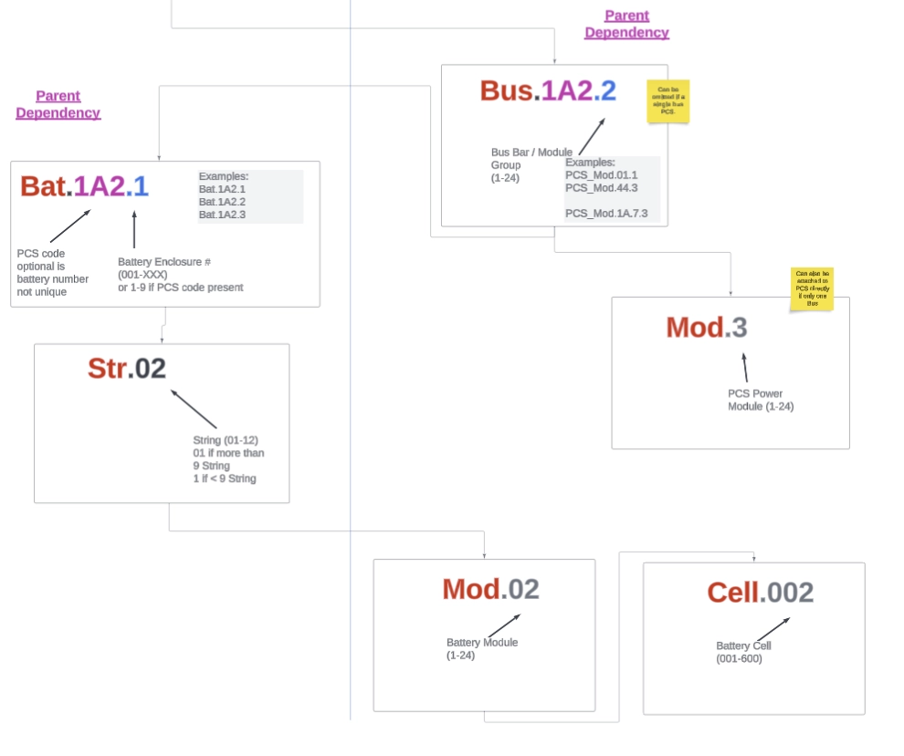
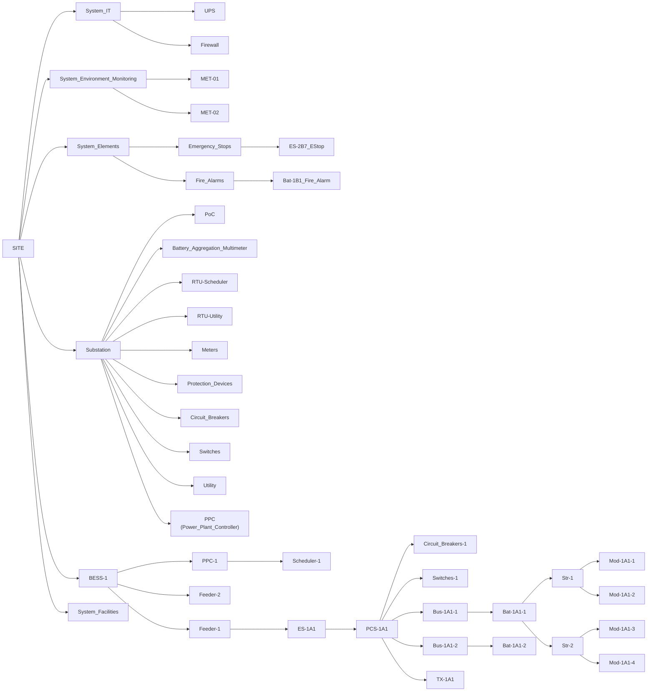

# Taxonomy — Naming, Codes & Prefix Conventions



**Status:** template, populated in a facilitated session (skill: `definitions-taxonomy`). The [definitions.md](./definitions.md) file defines *what terms mean*; this file defines *which term to use* and *how to code it*.

Every document generated from the EIM (registers, matrices, reports) carries codes and prefixes. This file is the single authority for those conventions. When two documents disagree on a name or code, this file wins, and the divergent document gets fixed.

---

## 1. Organization codes

One short, stable code per organization. Used in document IDs, interface IDs, contact registers, and anywhere a party is referenced in structured form. Rules:

- 2–5 characters, uppercase, unique within the project.
- Code the **company**, not the role (roles change; one utility may be offtaker, TO, and BA at once).
- Record every alias/spelling seen in source documents so searches don't miss them.

| Code | Legal name | Short name | Roles on this project | Aliases seen in documents |
|------|-----------|------------|----------------------|---------------------------|
| ❓ | | | | |

> ❓ = code not yet assigned: assign in session and apply consistently in new documents.

---

## 2. Canonical equipment IDs & segment hierarchy

This section defines the **canonical equipment IDs** for physical devices that generate or receive data. It governs:

- Asset-register naming (what appears on nameplates and in the CMMS)
- SCADA tag roots (how the telemetry hierarchy maps to physical equipment)
- Outage Tracker unit references (which device an event is attributed to)

It does **not** govern:
- Manufacturer-internal naming (BMS cell/module identifiers, etc.)
- SCADA point-level tag names (those live in the [Telemetry Map](/Data_Product%28DP%29/Grid_Telemetry_Mapping/grid-telemetry-map.md))
- Network device hostnames (those are IT infrastructure, not process equipment)

### 2a. Format

**Dot-separated segments; hyphen-separated type and code.**

```
Type-Code
Type-ParentCode-ChildCode
```

- **External** (field-visible, nameplate-readable): fully qualified with location codes. `PCS-1A2`, `Bat-1A2-1`, `ES-11A1`.
- **Internal** (behind doors, context-dependent): simple sequential within parent. `Str-01`, `Mod-2`, `Cell-15`.

No slashes, no mixed separators.

### 2b. Block types and station configurations

Unused levels are **omitted**, not zero-padded.

Two block (container) types:

| Block type | Description | Typical use case |
|---|---|---|
| **AC Block (ACB)** | Integrated PCS+battery in one enclosure, AC output. Leaf node at owner level — no visible Bus or separate Bat. | Containerized all-in-one BESS units |
| **DC Block (Bat)** | DC battery container with no inverter; connects to an external PCS. | Rack-based DC container designs |

An **Energy Station (ES)** is the combination of blocks behind one block transformer, in one of two configurations:

| Configuration | Composition | Hierarchy |
|---|---|---|
| **AC station** | Multiple AC blocks + TX | ES → ACB (leaf); TX under ES |
| **DC station** | Multiple DC blocks + one or more PCS + TX | ES → PCS → (Bus →) Bat; TX under ES. Bus is explicit only when there are multiple DC buses or several PCS share one; a single implicit bus is omitted. |

### 2c. Segment hierarchy

| Level | Segment | Code format | Required | Used by | Description |
|---|---|---|---|---|---|
| 0 | **Site** | `Site` or project code | Always | All | Project root |
| 1 | **PoC** | `PoC-{N}` | If multiple grid connections | All | Point of Connection / POI. Site-level; may serve multiple BESS. |
| 1 | **BESS** | `BESS-{N}` | Always | All | Complete plant or subdivision. |
| 2 | **Feeder** | `Feeder-{L}` | If multiple feeders | All | Distribution circuit. |
| 3 | **ES** | `ES-{Code}` | If grouped into stations | AC, DC | Energy Station: the blocks behind one block transformer (Block, Skid, FNE). |
| 4 | **PCS** | `PCS-{Code}` | If separate from battery | DC | Inverter. Parent of the DC blocks, directly or via Bus. |
| 4 | **ACB** | `ACB-{Code}-{NN}` | If integrated | AC | AC block unit (PCS + battery integrated). Leaf node at owner level. |
| 4 | **TX** | `TX-{Code}` | If block-level transformer | AC, DC | Block transformer. Under ES. |
| 5 | **Bus** | `Bus-{N}` | If multiple DC buses | DC | DC Bus. Child of PCS, parent of Bat. Explicit only when multiple buses exist or PCS share one; a single implicit bus is omitted. |
| 6 | **Bat** | `Bat-{Code}-{NN}` | If separate enclosure | DC | DC block (battery container). Child of PCS (implicit bus) or Bus. |
| 7 | **Str** | `Str-{NN}` | If accessible | All | String (internal to Bat). |
| 8 | **Mod** | `Mod-{NN}` | If accessible | All | Module (internal to Str). |
| 9 | **Cell** | `Cell-{NNN}` | If accessible | All | Cell (internal to Mod). |

**Legend:** `{N}` = single digit; `{NN}` = two digits 01-99; `{NNN}` = three digits 001-999; `{L}` = letter A-Z; `{Code}` = alphanumeric location code.

#### How the hierarchy collapses per configuration

**AC station example:**
```
Site → BESS-1 → Feeder-11A → ES-11A1 → ACB-11A1-1
                                    → ACB-11A1-2
                                    → ACB-11A1-3
                                    → ACB-11A1-4
                                    → TX-11A1
```
The AC block unit is the leaf. PCS, Bus, and Bat are **not split out** at owner level. Internal Str/Mod/Cell are manufacturer-scope.

**DC station, single PCS, implicit bus:**
```
Site → BESS-1 → Feeder-11A → ES-11A1 → PCS-11A1 → Bat-11A1-1 → Str-01 → Mod-01
                                                → Bat-11A1-2 → Str-01 → Mod-01
                                    → TX-11A1
```
The DC blocks hang off the PCS. TX is under ES. Bus is implicit (single bus per PCS) and omitted.

**DC station, multiple PCS with explicit buses:**
```
Site → BESS-1 → Feeder-11A → ES-11A1 → PCS-11A1 → Bus-1 → Bat-11A1-1
                                                          → Bat-11A1-2
                                    → PCS-11A2 → Bus-1 → Bat-11A2-1
                                                          → Bat-11A2-2
```
PCS is parent of Bus; Bus is parent of Bat. Multiple PCSs may share a Bus.

### 2d. Naming rules

| Category | Format | Rule | Example |
|---|---|---|---|
| **External** (field-visible nameplate) | `Type-Code` | Full location code. Readable at the equipment nameplate. | `PCS-1A2`, `ES-11A1`, `ACB-11A1-3` |
| **Internal** (behind doors) | `Type-{NN}` | Sequential. Context from parent path. | `Str-01`, `Mod-02`, `Cell-015` |

**External segments:** PoC, BESS, Feeder, ES, PCS, ACB, TX, Bat.
**Internal segments:** Bus (when implicit), Str, Mod, Cell.

### 2e. Topic path examples

| Configuration | Path | Description |
|---|---|---|
| AC station | `Site.BESS-1.Feeder-11A.ES-11A1.ACB-11A1-3` | AC block unit 3 in station 11A1 |
| DC station (implicit bus) | `Site.BESS-1.Feeder-11A.ES-11A1.PCS-11A1.Bat-11A1-1.Str-01.Mod-02` | Module 2 in String 1 of DC block 1 on PCS 11A1 |
| DC station (explicit buses) | `Site.BESS-1.Feeder-11A.ES-11A1.PCS-11A1.Bus-1.Bat-11A1-2.Str-03` | String 3 in DC block 2 on Bus 1 of PCS 11A1 |

### 2f. Electrical panels and system groups

Non-process equipment is grouped under the site as parallel systems:

| Group | Contents | Example children |
|---|---|---|
| `System_Elements` | Fire alarms, emergency stops, lighting | `Fire_Alarms`, `Emergency_Stops` |
| `System_Environment_Monitoring` | Weather stations, ambient sensors | `MET-01`, `MET-02` |
| `System_Facilities` | HVAC, access control, buildings | `HVAC-01` |
| `System_IT` | UPS, firewall, servers, switches | `UPS-01`, `Firewall-Primary` |
| `Substation` | PoC, meters, protection, circuit breakers | `PoC-1`, `Meter-1`, `Breaker-52F11` |

Site-level peers. Same `Type-Code` format, not children of any BESS.

example:





# TAXONOMY Example





### 2g. Logical tree diagram



> **Note:** The Mermaid diagram above shows the **DC station** pattern. For an AC station, replace `PCS → Bus → Bat` with `ACB` leaf nodes. Multiple PCS units may share a Bus.

---

## 3. Document & folder acronyms

Ratified and **applied to the folder names** as `Folder_Name(ACR)` for easier navigation. Markdown links to these paths must percent-encode the parentheses (`%28`/`%29`). `Project_Documentation` keeps its name (scaffolding).

**Acronym suffixes are top-level only.** A folder nested inside an acronym-suffixed folder uses its plain name; no second acronym in the path. So the products under `Data_Product(DP)/` are plain-named (`Monthly_Performance_Report/`, `Outage_Tracker/`, `Settlement_Reconciliation/`), not `…(MPR)` / `…(GADS)` / `…(SR)`. Stacked acronyms in one path are harder to read than the names they abbreviate. A folder that **moves under `Data_Product(DP)/` drops its acronym suffix on the way in**, and its acronym leaves the registry below.

**Acronyms are folder-only; never in filenames.** The document inside an acronym-suffixed folder uses its plain kebab-case name (`entity-interaction-map.md`, not `Entity_Interaction_Map(EIM).md`): the acronym already lives on the folder, and repeating it in the file doubles the parentheses-encoding burden in links.

| Acronym | Folder |
|---------|--------|
| EIM | Entity_Interaction_Map(EIM) |
| CR | Contact_Register(CR) |
| DIR | Data_Interface_Register(DIR) |
| PGM | Performance_Guarantee_Matrix(PGM) |
| WOM | Warranty_Obligation_Matrix(WOM) |
| DP | Data_Product(DP): parent folder for generated deliverables; product subfolders are plain-named |
| MT | Metrics_Tree(MT) |
| DT | Definitions_Taxonomy(DT) |

*Retired folder acronyms:* `MPR`, `OAP`/`GADS`, `SR`; those folders now sit under `Data_Product(DP)/` with plain names. **GADS** remains a live *term* in the glossary (NERC's Generating Availability Data System); it is simply no longer a folder code.

---

## 4. Prefix & ID conventions

How structured identifiers are built in generated documents. Agree the scheme **before** the satellite document that needs it, so IDs never need renumbering.

| Scope | Convention | Example |
|-------|------------|---------|
| EIM node IDs | stable uppercase snake IDs, never renamed once satellite docs reference them | `BESS_LTSA`, `OM_PROV` |
| Interface IDs (Data Interface Register) | ❓ e.g. `IF-<ORG>-<NN>` | |
| Guarantee IDs (Performance Guarantee Matrix) | ❓ e.g. `PG-<contract>-<NN>` | |
| Warranty IDs (Warranty Obligation Matrix) | ❓ e.g. `W-<NN>` | |
| KPI IDs | ❓ e.g. `KPI-<NN>` | |
| Grid telemetry point IDs (Grid Telemetry Map) | `GT-<NN>`: 01– outputs (BESS → grid), 51– inputs (grid → BESS). Columns use `source.tag` notation (`ems.`, `rtac.`, `scada.`, `historian.`, `plc.`, `meter.`, `dnp3.`); on-interface rows carry a `dnp3.*` grid address, not-yet-taken rows `reserved` | `GT-10` |
| Document versions | `vMAJOR.MINOR`, draft until v1.0; satellite docs pin `EIM_VERSION` | |

---

## 5. File & folder naming

- Folders: `Title_Case_With_Underscores(ACRONYM)` where an acronym is ratified (§3), e.g. `Data_Interface_Register(DIR)/`; percent-encode the parentheses in markdown links.
- Documents: kebab-case `.md` (e.g. `warranty-obligation-matrix.md`); source documents keep their original filenames for citability.
- Every folder carries an `index.md`; every non-reserved `.md` carries OKF frontmatter.

---

## 6. Open questions

- [ ] Assign organization codes (§1) and confirm legal entity names.
- [ ] Confirm architecture mode(s) for this project and adapt the segment hierarchy.
- [ ] Agree ID prefix schemes per satellite document before its build session.
- [ ] Add project-specific diagrams to §2f during the taxonomy session.
