# BESS Entity Interaction Map (EIM)

> **v1.1**
>
> **Purpose**: A template to map the people, companies, systems, and data flows surrounding a Battery Energy Storage System (BESS) asset.
>
> **Use case**: Fleet visibility, vendor accountability, data architecture planning, and onboarding new stakeholders.
>
> **Rendered in**: Any Markdown viewer that supports Mermaid (GitHub, Notion, Obsidian, VS Code, Typora etc.)
>
> **Working copy**: the Mermaid block inline in this file. A cloud Mermaid editor (Mermaid Chart / Mermaid.ai, editable by agents via MCP) is useful for drafting collaboratively, but it is a convenience copy rather than the record; see the callout below. Keep version history in the folder's `log.md` and open items in its `todo.md`.

> ### 🔗 View this diagram online
>
> A published, view-only copy is easier to read and pan than the block below:
>
> **[BESS-Groundwork Entity Interaction Map on Mermaid.ai](https://mermaid.ai/d/1c05018a-fbf7-408c-91d7-845094cabd3d)**
>
> **The diagram in this file is the source of truth.** The online copy is a convenience, not the record:
>
> - **It drifts.** Edit either copy and they diverge. Re-sync the block below after editing online, and re-fetch the online copy before editing it, because concurrent edits overwrite rather than merge.
> - **Access is not guaranteed.** Publishing depends on a subscription that may lapse, so the link may stop working. Nothing in this repo may depend on it, which is why the block below is the record.
>
> *Working in a clone? Replace the link with your own diagram, or delete this callout.*

## What is an Entity Interaction Map?

An entity interaction map is a topology diagram of the plant's operating ecosystem. Every node is a person, organization, data source or system that touches the asset. Every edge is a real relationship: a data flow, a control signal, a contract, or a manual hand-off.


## Goals for EIM

1. **Ground metrics in reality** — You cannot define what to measure until you know what exists. The EIM inventories sources, sinks, intermediaries, and data pathways so that any metrics tree is anchored to physical and contractual reality.
2. **Trace the full workflow** — An alarm is not just a data point; it is a trigger in a chain. Mapping BMS cell-voltage deviation → SCADA → APM → Battery OEM warranty review shows the actual process, not just the protocol. If the OEM node is missing, the warranty path is tribal knowledge.
3. **Give AI agents context they won't invent** — LLMs and autonomous agents need explicit boundaries about ownership, data custody, and interface contracts. The map provides the grounded topology that keeps agents from inventing relationships that do not exist.
4. **Anchor contracts to what is actually wired** — LTSA scopes, SLA boundaries, and warranty obligations map directly to nodes and edges. Gaps between contractual promises and actual data flows become visible immediately. An LTSA promising 99 % availability with no edge to the ISO OMS is a contract with no visible enforcement path.


## The EIM Diagram

```mermaid
flowchart TB
  
  %% BESS Asset group
  subgraph BESS["BESS Asset"]
      
      %% PPC
      PPC["PPC\n(Power Plant Controller/SCADA)"]:::data
      SCADA <--> PPC
      
      %% EMS
      EMS["EMS"]:::data
      M_BMS --> EMS
      BAT_CTRL --> EMS
      SCADA <--> EMS


      subgraph Substation["Substation"]
        %% SCADA
        TX_MAIN["Step Up Transformer"]:::asset
        HV_PROT["HV Protection Equipment"]:::asset
        TX_MAIN ---- HV_PROT
        POI["Point of Interconnection (POI)<br/>Revenue Meters"]:::asset
        SCADA["Substation RTAC/SCADA"]:::data 
        P&C["Substation P&C and Power Quality"]:::data ---|relay and meter data| SCADA
        RTAC["Grid RTAC"]:::data <---> SCADA
        FAC_CTRL["Control Room Building"]:::asset
        %% ISO / Grid 
        subgraph GTEL["ISO Telemetry"]
          
            APD["Available Discharge Power (MW)"]:::data
            %% APD --- APD_N["The max sustained active power the plant can currently deliver to the grid, considering all real-time constraints (SOC foldback, BMS limits, PCS derates, ...)."]:::note
            APC["Available Charge Power (MW)"]:::data
            %% APC --- APC_N["The max sustained active power the plant can currently absorb from the grid. Symmetric counterpart to APD but for the charging direction."]:::note
            SOC["State of Charge (MWh)"]:::data
            %% SOC --- SOC_N["Currently available discharge energy from present battery state that can be delivered at rated power."]:::note
            MAXENER["Maximum Energy (MWh)"]:::data
            %% MAXENER --- MAXENER_N["Total usable energy capacity of the system, reflecting current SOH and equipment availability but not current SOC. Slow-varying — changes only with degradation or unit availability changes."]:::note
            MODE["Mode (AS, AGC, ADS, ...)"]:::data
            %% MODE --- MODE_N["Current control regime of the plant. e.g. AS: Ancillary Services (Regulation, Spin, Non-Spin), AGC: Following Automatic Generation Control, ADS: Following Automated Dispatch System schedule, MAN: Manual / local operator control, OFF: Plant offline or unavailable."]:::note
            OP_Metrics["Operational Metrics"]:::data
        end
      
      
      end
      %% Station Service
      SS["Station / auxiliary service supply"]:::asset --- Substation

      
      SS --> FAC_OM
      SS --> FAC_CTRL
      %% O&M Building
      FAC_OM["O&M Building"]:::asset


      PCS ---- TX_MAIN
      TX_MAIN --- POI
      HV_PROT --- POI

      %% PCS Skids
      subgraph PCS_Skid["PCS Skids"]
        PCS["PCS"]:::asset --- INV["Inverter_Modules"]:::asset
        INV["Inverter_Modules"]:::asset
        INV_CTRL["Inverter Controller"]:::data
        INV_CTRL <--> PCS
        BAT_CTRL["Battery Controller"]:::data
          %% PCS
        INV_CTRL <-->|PQ commands| PPC
      end

      %% Bat Enclosure
      subgraph BAT_Encl["Battery Enclosures"]
        BAT["Battery"]:::asset --- ST["Strings"]:::asset
        STR_BMS["String BMSs"]:::data
        M_BMS["Master BMS"]:::data
      
        ST --- STR_BMS
        STR_BMS --> M_BMS
        M_BMS --> BAT_CTRL

        BAT_CTRL -->|SoC\n Strings Connected\n | PPC
        %% BAT_CTRL --> PPC PPC reads SoC and Limits to provide power balancing
      end
  
  end

    INV_CTRL --> EMS
    BAT_CTRL <--> INV_CTRL
    INV_CTRL <--> INV
  
    %% BESS Controls
    PPC --> EMS
    EMS -->|Operating Mode| PPC

    %% Owner
    AO(("BESS Asset Owner")):::owner === BESS

    %% LANDOWNER
    LANDOWNER["Land Owner"]:::company === AO

    %% Asset Owner contractual relationships
    AO === AM["Asset Manager"]:::company
    AO === INS["Insurer"]:::company
    %% Investor Lender
    AO === IL["Investors / Lender"]:::company
    IL --- IE["Independent Engineer"]:::company
    
    %% LTSA
    AO === BESS_LTSA["BESS LTSA / O&M Provider"]:::company
    AO === SUB_LTSA["Substation LTSA / O&M Provider"]:::company
    
    %% GOP
    AO === GOP["Generator Operator\n"]:::company
    
    %% GIA
    AO ===|Generator Interconnection Agreement| TO["Transmission Owner / interconnection provider"]:::company
    
    %% Offtaker
    AO === OFFTAKER["offtaker / revenue counterparty\n (Tolling Agmnt - Market)"]:::company
    AM <--> OFFTAKER
    
    %% optimiser
    AO === OPT["Optimizer"]:::company
    AO === SC["Scheduling Coordinator\n QSE\n Route to Market Provider"]:::company
    TAD -->|API| OPT
    OPT --> SC
    SC -->|"ISO Trading Platform"| TAD
    OPT <-->|"daily call\n weekly report"| AM

    %% Asset Data Interaction
    AO <-->|settlements| SET
    AO <--> APM
  
    %% Grid / Interconnection
    subgraph GRID["Grid & Market Interface"]
        TD["Transmission / Distribution Grid"]:::asset
        TD --> SS
        BA["Balancing Authority\n ISO"]:::company
        
        TOP["Transmission Grid Operator<br/>Real-time Desk"]:::company
        OMS["ISO Outage<br/>Management System (OMS)"]:::data
        SET["Settlement System"]:::data
        MD["Market Data"]:::data
        TAD["Market Trade & Award Data"]:::data

    end

    TO --- TD

    %% Grid
    PCS --- POI
    POI --- TD
    RTAC --> TD 

    PPC <--> RTAC
    RTAC <--> GTEL
    RTAC <--> TOP
    RTAC --> POI

    %% Balancing Authority

    BA <--> OMS
    BA --> MD
    BA --> TAD
    BA --> SET
    POI --> SET

    %% operational flows
    AM --> EMS["EMS\n(Energy Management System)"]
    APM["APM / Battery Analytics"]:::data --> AM

    AM <--> INS
    AM <--> IL
    EMS -->|API| APM
 
    %% LTSA Provider / O&M
    BESS_LTSA -->  BESS_LTSA_TS["LTSA Support Ticketing System"]:::data
    BESS_LTSA --> CMMS["LTSA Provider CMMS\n (Computerized Maint. Management System)"]:::data 
    
    BESS_LTSA -->  F_TECH["Field Technicians"]
    BESS_LTSA === ROCC["ROCC\n (Remote Operation Control Center)"]:::company
    %% OEMs
    BESS_LTSA ===  BAT_OEM["Battery OEM"]:::company 
    BESS_LTSA ===  PCS_OEM["PCS OEM"]:::company
    BESS_LTSA ===  EMS_OEM["EMS OEM"]:::company

    F_TECH <--> CMMS
    F_TECH <--> ROCC
    
    %% Bat OEM
    BAT_OEM --> BAT_OEM_CMMS["Bat OEM CMMS"]:::data
    BAT_OEM --> BAT_OEM_SPARES["Bat Spares"]:::asset
    BAT_OEM --> BAT_OEM_W["Bat OEM Defect/Capacity Warranty"]
    BAT_OEM --- BAT_OEM_SA["Bat OEM LTSA / Avail Guaranty"]

    %% PCS OEM
    PCS_OEM --> PCS_OEM_CMMS["PCS OEM CMMS"]:::data
    PCS_OEM --> PCS_WAR["PCS OEM Warranty"]
    PCS_OEM --> PCS_SA["PCS Service Agreement"]
    PCS_OEM --> PCS_OEM_SPARES["PCS Spares"]:::asset
    
    %% EMS
    EMS_OEM --> EMS_WAR["EMS OEM Warranty"]
    EMS_OEM --> EMS_SA["EMS Service Agreement"]
    EMS_OEM --- EMS_TICK["EMS Support Ticketing System"]:::data
      EMS_OEM --> EMS_OEM_SPARES["EMS Spares"]:::asset
    
    %% EPC
    AO === EPC_BESS["BESS EPC Contractor"]:::company
    BESS_LTSA ---|warranty management| EPC_BESS
    EPC_BESS --> EPC_BESS_WAR["EPC Workmanship Warranty"]
    
    %% Substation LTSA 
    AO === EPC_SUB["Substation EPC Contractor"]:::company
    SUB_LTSA ---|warranty management| EPC_SUB

    EPC_SUB --> EPC_SUB_WAR["Substation Workmanship Warranty"]
    SUB_LTSA --- SUB_SPARES["Substation Spares"]:::asset
    

    %% Generator Operation
    GOP --> BESS_LTSA_TS
    EMS --> GOP
    GOP <--> PPC
    GOP <--> SCADA
    GOP --> SC
    SC --> OMS
    GOP <--> TOP

    %% Asset MAnagement
    AM --- AM_A["Accounting Platform"]:::data
    APM <-->|ledgers| AM_A



    %% --- Class assignments ---


    CMMS:::data
  
    %% --- Style definitions ---
    classDef asset_group   fill:#3b82f6,stroke:#1e3a8a,stroke-width:2px,color:#fff
    classDef asset   fill:#1E90FF,stroke:#1e3a8a,stroke-width:2px,color:#fff
    classDef owner   fill:#111827,stroke:#000,stroke-width:2px,color:#fff
    classDef company fill:#dcfce7,stroke:#15803d,stroke-width:1.5px,color:#064e3b
    classDef person  fill:#ffedd5,stroke:#9a3412,stroke-width:1.5px,color:#7c2d12
    classDef data    fill:#f3e8ff,stroke:#7e22ce,stroke-width:1.5px,color:#581c87
    classDef note fill:#FFF8E1,stroke:#BA7517,color:#633806,stroke-dasharray:3 3,font-style:italic
```



---


## How to use this template

1. **Draw what exists** (Stage 1). Edit the Mermaid diagram below. Tag every node with a class (`:::asset`, `:::owner`, `:::company`, `:::person`, `:::data`). If a node feels ambiguous, your org chart is ambiguous—good signal.

2. |     Style      | Entity Type     | Description                                                  | Example                                  |
   | :------------: | :-------------- | :----------------------------------------------------------- | :--------------------------------------- |
   |  **:::asset**  | **Asset**       | The physical or logical systems you are mapping around. The "center of gravity." | Battery Units, BMS, PCS, EMS             |
   |  **:::owner**  | **Owner**       | The legal or economic principal. There is usually exactly one. | Asset Owner, Fund                        |
   | **:::company** | **Company**     | Organizations with contractual or operational relationships. | Asset Manager, OEM, ISO, Insurer         |
   | **:::person**  | **Person**      | Named individuals (not shown in this template, but reserved). | Site Manager, Data Engineer              |
   |  **:::data**   | **Data Source** | Systems, databases, or feeds that store or transmit data.    | CMMS, OMS, Market Data, Ticketing System |

   

3. **Enrich** (Stage 2). Annotate edges with protocol, frequency, and contract reference. Add named individuals where accountability matters.

4. **Define** (Stage 3): Add definitions and comments to increase context toward ontology.

> **Tip:** If you have *named individuals* (e.g. a specific operations manager), add them as `person` nodes so you know who to call when a data feed breaks.

### Adding a Person node
```mermaid-example
SM["Jane Doe<br/>Site Manager"]:::person --> EMS
```

### Adding a new data source
```mermaid-example
AM --> ETR["ETRM / Scheduling"]:::data
```

### Changing relationship strength
| Syntax | Meaning |
|--------|---------|
| `A --- B` | Physical / logical connection |
| `A --> B` | Operational / data flow |
| `A <--> B` | Bidirectional flow |
| `A === B` | Contractual / ownership |

### Annotating with comments, labels, and notes

Mermaid supports several ways to add context without cluttering the visual topology:

| Technique | Syntax | Use case |
|:---|:---|:---|
| **Line comments** | `%% TODO: add OMS feed` | Mark incomplete edges, TODOs, or section headers. Comments are invisible in the rendered diagram. |
| **Edge labels** | `BMS -->\|CSV, monthly\| APM` | Annotate the protocol, frequency, or contract that governs a specific edge. |
| **Multi-line node text** | `BOEM["Battery OEM<br/>Warranty: LTSA §4.2"]` | Attach metadata (contract clause, named owner, data spec) directly to a node. |
| **Invisible nodes for notes** | `NOTE["⚠️ Uninstrumented: operator emails trader daily"]:::note` | Add free-floating annotations. Style with a dedicated `classDef`. |

**Example combining techniques:**

```mermaid-example
%% Stage 1: existing flows
BMS -->|Modbus TCP, 1 Hz| SCADA["Site SCADA<br/>Owner: O&M Provider"]
SCADA -->|OPC-UA| HIST["Historian<br/>Retention: 3 years"]

%% TODO: verify if EMS writes setpoints directly to PCS or via PPC
EMS --> PPC

NOTE["Tribal knowledge: operator texts optimizer<br/>before morning bid"]:::note
```

> **Tip:** Use `%%` comments aggressively in Stage 1. They are the fastest way to record uncertainty without pretending an edge is fully defined.

---


##  Definitions

> Signal names in the ISO Telemetry block (`APD`/`APC`/`MAXENER`, modes like `ADS`) are CAISO-style examples — adapt to the project's market (ERCOT, WEIM, PJM, etc. use different point names and dispatch systems).

**Available Discharge Power (MW)**: `APD`
The max sustained active power the plant can currently deliver to the grid, considering all real-time constraints (SOC foldback, BMS limits, PCS derates,... ).

**Available Charge Power (MW)**: `APC`
The max sustained active power the plant can currently absorb from the grid. Symmetric counterpart to APD but for the charging direction.

**State of Charge (MWh)**: `SOC`
Currently available discharge energy from present battery state that can be delivered at rated power. 

**Maximum Energy (MWh)**: `MAXENER`
Total usable energy capacity of the system, reflecting current SOH and equipment availability but **not** current SOC. Slow-varying that changes only with degradation or unit availability changes.

**Mode**: `MODE`
Current control regime of the plant. e.g. `AS`:  Ancillary Services (Regulation, Spin, Non-Spin), `AGC`:  Following Automatic Generation Control, `ADS`:  Following Automated Dispatch System schedule, `MAN`: Manual / local operator control, `OFF` : Plant offline or unavailable


## License

Licensed under the Apache License, Version 2.0.
You may obtain a copy of the License at [https://www.apache.org/licenses/LICENSE-2.0](https://www.apache.org/licenses/LICENSE-2.0)

> **Contributions welcome.** If you extend this for solar, wind, or other asset classes, open a pull request so the industry benefits.
