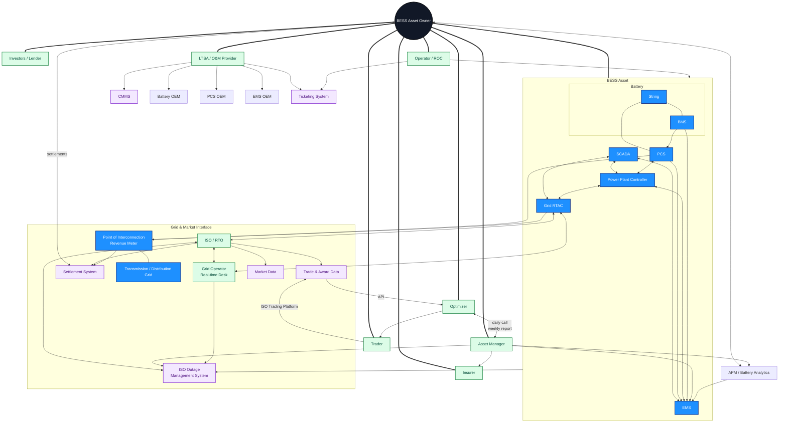

# BESS Entity Interaction Map (EIM)

> **v1.0** · [Librenergy](https://librenergy.com)

> **Purpose:** A one-page template to map the people, companies, systems, and data flows surrounding a Battery Energy Storage System (BESS) asset.

> **Use case:** Fleet visibility, vendor accountability, data architecture planning, and onboarding new stakeholders.

> **Rendered in:** Any Markdown viewer that supports Mermaid (GitHub, Notion, Obsidian, VS Code, Typora etc.)

---

## What is an Entity Interaction Map?

An entity interaction map is a topology diagram of the plant's operating ecosystem. Every node is a person, organization, or system that touches the asset. Every edge is a real relationship: a data flow, a control signal, a contract, or a manual hand-off.

The map answers one question: **who is connected to whom, by what mechanism, and in what direction?**

It is a standalone inventory of the asset's operational topology. Metrics trees, alarm playbooks, AI agent prompts, and contract reviews all draw context from it—but the map exists whether or not those downstream artifacts do.

---

## What it's for

Draw the map first. It stands on its own, but it also makes every downstream job easier.

1. **Ground metrics in reality** — You cannot define what to measure until you know what exists. The map inventories sources, sinks, intermediaries, and data pathways so that any metrics tree is anchored to physical and contractual reality. If the edge PCS → SCADA → historian does not exist, "PCS forced outage rate" is an aspiration, not a metric.
2. **Trace the full workflow** — An alarm is not just a data point; it is a trigger in a chain. Mapping BMS cell-voltage deviation → SCADA → APM → Battery OEM warranty review shows the actual process, not just the protocol. If the OEM node is missing, the warranty path is tribal knowledge.
3. **Give AI agents context they won't invent** — LLMs and autonomous agents need explicit boundaries about ownership, data custody, and interface contracts. The map provides the grounded topology that keeps agents from inventing relationships that do not exist.
4. **Anchor contracts to what is actually wired** — LTSA scopes, SLA boundaries, and warranty obligations map directly to nodes and edges. Gaps between contractual promises and actual data flows become visible immediately. An LTSA promising 99 % availability with no edge to the ISO OMS is a contract with no visible enforcement path.

---

## Edge types

| Line type | What it is | Example |
|:---|:---|:---|
| **Telemetry** | Sensor data, status, historian records | BMS → SCADA: cell V/I/T at 1 Hz |
| **Command / control** | Setpoints, dispatch signals, limits | ISO → PPC: AGC signal; EMS → PCS: power setpoint |
| **Contract / SLA** | Obligations, guarantees, penalties | Owner → LTSA: availability guarantee; Owner → Insurer: coverage terms |
| **Reporting / settlement** | Invoices, claims, data feeds | Asset Manager → ISO OMS: availability declarations; APM → Lender: monthly SoH report |
| **Incident / ticket** | Alarms, work orders, safety events | BMS → O&M: fire-suppression activation; O&M → CMMS: repair ticket |

---

## Legend

| Style | Entity Type | Description | Example |
|:-----:|:------------|:------------|:--------|
| ■ **Blue** | **Asset** | The physical or logical systems you are mapping around. The "center of gravity." | Battery Units, BMS, PCS, EMS |
| ■ **Black** | **Owner** | The legal or economic principal. There is usually exactly one. | Asset Owner, Fund |
| ■ **Green** | **Company** | Organizations with contractual or operational relationships. | Asset Manager, OEM, ISO, Insurer |
| ■ **Amber** | **Person** | Named individuals (not shown in this template, but reserved). | Site Manager, Data Engineer |
| ■ **Purple** | **Data Source** | Systems, databases, or feeds that store or transmit data. | CMMS, OMS, Market Data, Ticketing System |

---

## Two-stage process

**Stage 1: Map what exists.**
Draw every actor, every system, every data flow you can find. Be honest. If the BMS vendor emails CSVs once a month instead of streaming telemetry, draw that line and label it "CSV, monthly, manual." Don't draw the process you wish you had. Draw the one you actually have.

**Stage 2: Enrich.**
Add the metadata that downstream work depends on:
- **Contracts:** Which LTSA, SLA, or warranty clause applies to this node?
- **Data specs:** Protocol, schema, frequency, retention, and custody for every edge.
- **Owners:** Named individuals or teams responsible for each endpoint.
- **AI notes:** Ambiguity, tribal knowledge, or known drift that an agent should account for.

The map is living documentation. Update it when contracts change, systems migrate, or new vendors are onboarded.

---

## How to use this template

1. **Copy and rename** (e.g. `projectA-entity-map.md`).
2. **Draw what exists** (Stage 1). Edit the Mermaid diagram below. Tag every node with a class (`:::asset`, `:::owner`, `:::company`, `:::person`, `:::data`). If a node feels ambiguous, your org chart is ambiguous—good signal.
3. **Enrich** (Stage 2). Annotate edges with protocol, frequency, and contract reference. Add named individuals where accountability matters.
4. **Commit and share.** It becomes the common reference for metrics design, AI agent context, contract review, and onboarding.

> **Tip:** If you have *named individuals* (e.g. a specific operations manager), add them as `person` nodes so you know who to call when a data feed breaks.

---

## The EIM Diagram



---

## Customizing for your asset

### Adding a Person node
```mermaid-example
SM["Jane Doe<br/>Site Manager"]:::person --> EMS
```

### Adding a new data source
```mermaid-example
AM --> ETR["ETRM / Scheduling"]:::data
```

### Changing relationship strength
| Syntax | Meaning |
|--------|---------|
| `A --- B` | Physical / logical connection |
| `A --> B` | Operational / data flow |
| `A <--> B` | Bidirectional flow |
| `A === B` | Contractual / ownership |

### Annotating with comments, labels, and notes

Mermaid supports several ways to add context without cluttering the visual topology:

| Technique | Syntax | Use case |
|:---|:---|:---|
| **Line comments** | `%% TODO: add OMS feed` | Mark incomplete edges, TODOs, or section headers. Comments are invisible in the rendered diagram. |
| **Edge labels** | `BMS -->|CSV, monthly| APM` | Annotate the protocol, frequency, or contract that governs a specific edge. |
| **Multi-line node text** | `BOEM["Battery OEM<br/>Warranty: LTSA §4.2"]` | Attach metadata (contract clause, named owner, data spec) directly to a node. |
| **Invisible nodes for notes** | `NOTE["⚠️ Uninstrumented: operator emails trader daily"]:::note` | Add free-floating annotations. Style with a dedicated `classDef`. |

**Example combining techniques:**

```mermaid-example
%% Stage 1: existing flows
BMS -->|Modbus TCP, 1 Hz| SCADA["Site SCADA<br/>Owner: O&M Provider"]
SCADA -->|OPC-UA| HIST["Historian<br/>Retention: 3 years"]

%% TODO: verify if EMS writes setpoints directly to PCS or via PPC
EMS --> PPC

NOTE["Tribal knowledge: operator texts optimizer<br/>before morning bid"]:::note
```

> **Tip:** Use `%%` comments aggressively in Stage 1. They are the fastest way to record uncertainty without pretending an edge is fully defined.

---

## License

Licensed under the Apache License, Version 2.0.
You may obtain a copy of the License at [https://www.apache.org/licenses/LICENSE-2.0](https://www.apache.org/licenses/LICENSE-2.0)

> **Contributions welcome.** If you extend this for solar, wind, or other asset classes, open a pull request so the industry benefits.
