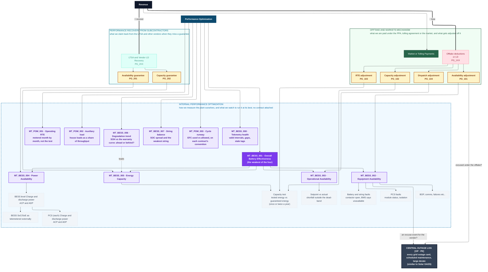

# Metrics Tree

**Project:** `{{PROJECT_NAME}}`  **Market/ISO:** `{{ISO}}`  **Version:** `{{VERSION}}`  **Last updated:** `{{DATE}}`
**Source EIM version:** `{{EIM_VERSION}}`  **Source ONT version:** `{{ONT_VERSION}}`

> **One document, two things.** The **tree** is the map: everything that affects revenue, grouped by the agreement that governs it, down to what a performance engineer monitors. The **per-segment metric registry** below it lists every metric with its code and its one definition home. Nothing else lives here: targets for performance-guarantee metrics are in the [PGM](../Performance_Guarantee_Matrix%28PGM%29/performance-guarantee-matrix.md), owner-metric thresholds and sources of truth are in each metric's calculation sheet, and event-tagging process is the [Outage Tracker](../Data_Product%28DP%29/Outage_Tracker/outage-tracker.md)'s.

> **Everything here is a metric**: a calculated quantity with exactly one authoritative definition (formula, inputs and their sources, boundary, clock), so the platform, the vendor, the offtaker, and the monthly report produce the *same number*. A target is a property a metric carries in its definition home, not a separate kind of thing. Where a quantity carries **two contractual definitions** (availability and RTE routinely differ between the offtake agreement and the service agreement), define **two metrics, one per contract**, each with its own sheet and reporting chain. Never merge them.
>
> **Metric identity and homes.** Performance-guarantee metrics carry their **PG_xxx** ID (three digits, series by counterparty, per the [PGM](../Performance_Guarantee_Matrix%28PGM%29/performance-guarantee-matrix.md) header) and are defined in the PGM and its calc sheets. Owner metrics (engineering + monitoring) carry **`MT_<SEG_TYPE>_<NNN>`** codes (segment type = the grain the metric reports at, three digits, append-only per series) and are defined in [calculations/](calculations/index.md). Both schemes are registered in the [ontology's taxonomy](../Ontology%28ONT%29/taxonomy.md). **One definition home per metric; every other appearance is a link.**

> ### 🔗 View this diagram online
>
> A published, view-only copy is easier to read and pan than the block below:
>
> **[BESS-Groundwork Metric Tree on Mermaid.ai](https://mermaid.ai/d/c658a0fc-b68f-4dd5-a42d-1168ffb6086d)**
>
> **The diagram in this file is the source of truth.** The online copy is a convenience, not the record:
>
> - **It drifts.** Edit either copy and they diverge. Re-sync the block below after editing online, and re-fetch the online copy before editing it, because concurrent edits overwrite rather than merge.
> - **Access is not guaranteed.** Publishing depends on a subscription that may lapse, so the link may stop working. Nothing in this repo may depend on it, which is why the block below is the record.
>
> *Working in a clone? Replace the link with your own diagram, or delete this callout.*

## What the tree is

A single map of **everything worth measuring on the plant**, so that each box on it can be monitored. It has **two top nodes**, because there are two reasons to measure anything here:

- **Revenue**: the money walk. How faults and shortfalls roll up through the four availability types into the contractual numbers that move money, across the two agreements that govern them.
- **Performance Optimization**: the owner's own root. How we measure the plant ourselves, and what we watch to run it at its best, with no contract attached. Nothing in it moves money directly, which is why it is a separate root rather than a branch of the first: adding it into the money walk would be arithmetically false.

The two meet in one place: the contract boxes point **into** the owner's measurement core (OBE and the four availabilities), because the plant is measured once and both agreements read the same nodes.

It is deliberately shaped around **what a performance engineer monitors**, not around a generic revenue model. It stops at the metric level on purpose: **where each number comes from is not a question for this tree.** Systems, tags and interfaces are settled later, in the [Data Interface Register](../Data_Interface_Register%28DIR%29/data-interface-register.md). Putting them here only crowds out the thing the tree is for.

**What it is for:**

- **Root-causing a headline miss.** Walk down from the LD or the guarantee, into the availability type responsible, to the fault or signal underneath.
- **Seeing both sides of the same event.** The same outage feeds two contracts with different formulas, clocks, and verdicts. The tree shows both paths and refuses to link them.
- **Setting the monitoring scope.** Every box is something to watch. If a box has no monitoring behind it, that is the gap.
- **Scoping dashboards and the monthly report.** The tree is the menu; pick the nodes each audience needs.

## How to use it

1. Copy this folder for your project (do not edit the base template).
2. Run [`eim-review-build`](../Entity_Interaction_Map%28EIM%29/entity-interaction-map.md) first. The tree references EIM node IDs, and the [Data Interface Register](../Data_Interface_Register%28DIR%29/data-interface-register.md) and [Performance Guarantee Matrix](../Performance_Guarantee_Matrix%28PGM%29/performance-guarantee-matrix.md) supply source references and contractual definitions.
3. **Keep the PG_xxx references in step with the [PGM](../Performance_Guarantee_Matrix%28PGM%29/performance-guarantee-matrix.md).** Each LD and guarantee node carries its guarantee ID so the two documents tie together; levels, rates and clocks live in the PGM, never here. **This tree is the source of truth for what gets monitored**, so every node must have a PGM row. PGM §1.3 holds the mapping and lists the rows deliberately not drawn here.
4. Prune or extend to match the actual contract stack. A merchant asset replaces the deductions side with market streams; a project with no service agreement loses the recovery side entirely.
5. Fill the node-definition table and the per-segment registry; write one calculation sheet per owner metric in [calculations/](calculations/index.md). The **sheets** are where each number gets its inputs, sources of truth, boundary, clock and target; the tree deliberately does not carry them.
6. Re-stamp `{{EIM_VERSION}}` whenever the source EIM changes.

## The tree

> **Reading it.** Two dark top nodes, read down from either. Under **Revenue**: money, then the adjustment or guarantee, in the two solid contract boxes. Under **Performance Optimization**: the dashed owner box, where every adjustment and guarantee resolves to how it is measured and what sits underneath. Amber nodes are contractual; purple nodes are owner metrics that resolve to a registry row below; dashed-grey nodes are what you look at when the purple one moves.

## Reading the tree

### Two top nodes, three boxes

The tree is grouped by **who the number is settled with**, because that is the boundary that decides which formula applies, which clock it runs on, and who you argue with.

**Revenue** is the money walk. Two boxes hang off it:

**Box 1: OFFTAKE AND MARKETS MECHANISM.** What we are paid under the PPA, tolling agreement or the market, and what gets adjusted off it. The payment comes in; the adjustments come off it, one per contractual mechanism: availability, dispatch, capacity and RTE (`PG_1xx`).

**Box 2: PERFORMANCE RECOVERY FROM SUBCONTRACTORS.** What we claim back from the LTSA and other vendors when they miss a guarantee (`PG_2xx`). This is the only money the project can actually get *back*; the offtake side can only ever reduce a payment. The box holds the recovery head and the guarantees, nothing else: how each guarantee is measured is not the vendor's, so the guarantee nodes point down into the owner's box.

**Performance Optimization** is the owner's own root, peer to Revenue and never summed into it. One box hangs off it:

**Box 3: INTERNAL PERFORMANCE OPTIMIZATION.** How we measure the plant ourselves, and what we watch to run it at its best; no contract attached. Two families share the box:

- **The measurement core**: Overall Battery Effectiveness and the four availabilities it is built from, with the faults and signals underneath. Both contract boxes point into this core. That is the whole argument for measuring the plant once, properly, instead of once per contract.
- **The watch list**: degradation trend, operating RTE, auxiliary load, cycle runway, string balance, telemetry health. Leading indicators: each moves months before an amber node does.

**Between the boxes sits the central outage log**, deliberately outside all three.

Anything that does not change a number in a contract box, feed the measurement core, or lead one of them does not belong on the tree. That rule is what keeps it readable. It is why condition-monitoring items such as temperature envelopes and maintenance schedules are not drawn: they matter operationally and belong in the [PGM](../Performance_Guarantee_Matrix%28PGM%29/performance-guarantee-matrix.md) exclusions and the SOPs, but they are not a line in the money walk.

### The measurement core: OBE and the four availabilities

| | | |
|---|---|---|
| **EA** Equipment Availability | `MT_BESS_002` | Is the equipment on? |
| **OA** Operational Availability | `MT_BESS_003` | Did we follow the setpoint? |
| **PA** Power Availability | `MT_BESS_004` | Can we deliver full power right now? |
| **QA** Energy Capacity | `MT_BESS_005` | Do we still hold the energy we were promised? |

`OBE (MT_BESS_001) = the weakest of the four, averaged over every interval`. The full method is in the [Daily Performance Report §2](../Data_Product%28DP%29/Daily_Performance_Report/daily-performance-report.md); the tree just shows where each one connects to money. Power availability decomposes to the BESS-level charge and discharge capability (ACP and ADP), and that to each PCS's capability and the externally telemetered SOC/SOE, because that is where a derate first shows.

### The central outage log

One log, every event: every outage card raised with the grid operator, every trip, every derate, every piece of major downtime. It sits **outside every box on purpose**, because it belongs to neither agreement and is read by both.

The two edges into it are the two questions asked of the same event:

- **Excused under the offtake?** If not, it counts against the availability adjustment.
- **An excuse event for the vendor?** If so, it comes out of their denominator and they are not charged for it.

**One event, judged twice, and the two verdicts routinely disagree.** A comms failure or a BOP outage is typically the owner's problem under the offtake agreement and excused for the vendor. That gap is exactly what the log exists to make visible. Notice discipline lives here too: a planned outage without its notice on time usually converts to forced, which is a money event created by paperwork rather than by the plant.

The taxonomy is **GADS-aligned**, closest to how Solar GADS handles co-located storage today, since no standalone BESS GADS exists yet. Building it that way from day one means the log exports rather than gets rebuilt when NERC opens BESS reporting. The full event set, cause codes and per-contract verdict fields are specified in the [Outage Tracker](../Data_Product%28DP%29/Outage_Tracker/outage-tracker.md); this node is where it connects to the money.

### The lines that cross between the boxes

Five solid edges leave the contract boxes and land in the measurement core, and they are the most important thing on the diagram:

- **Availability adjustment → Equipment Availability**
- **Dispatch adjustment → Operational Availability**
- **Capacity adjustment and RTE adjustment → the capacity test** (two mechanisms, one test event)
- **Availability guarantee → Power Availability** and **Capacity guarantee → Energy Capacity**

Both sides use **the same nodes**, not copies. So one measurement serves both agreements even though the two contracts calculate, weight and excuse it completely differently.

The two contract boxes are otherwise drawn with **no line between them**. Different formulas, boundaries, clocks and LD pools, settled separately. Linking them would invite exactly the reconciliation mistake the rest of the toolkit warns about.

Inside the owner's box, the watch list reaches the measurement core by **dotted edges only** (degradation trend leads Energy Capacity). Dotted means "watch this first"; it never means "add this up".

**The tree stops at the metric level.** Which system, tag or interface supplies each number is a separate question, answered in the [Data Interface Register](../Data_Interface_Register%28DIR%29/data-interface-register.md) and in each metric's calculation sheet. Keeping it out is what lets the diagram stay a map of the money rather than a map of the plumbing.

### Node taxonomy

| Class | Style | Meaning |
|-------|-------|---------|
| **Root** | dark navy | Revenue: the money walk |
| **Second root** | dark sky blue | Performance Optimization: the owner's measurement core and watch list, peer to the money walk, never summed into it |
| **Contract box** | green (offtake and markets) / teal (recovery from subcontractors) | The counterparty the money inside it is settled with |
| **Owner box** | sky blue, dashed box | The measurement core and the watch list; no contract attached. The contract boxes point into it, never the reverse |
| **Central log** | slate, heavy border | Shared by both agreements, owned by neither, outside every box |
| **Performance guarantee** | amber, solid border | A contractual instrument (`PG_xxx`): owed to the offtaker or held from a vendor. Defined in the [PGM](../Performance_Guarantee_Matrix%28PGM%29/performance-guarantee-matrix.md) and its calc sheet |
| **Owner metric** | purple, solid border | An owner-computed metric with its `MT_` code. Defined in [calculations/](calculations/index.md); the sheet is written when the metric is built, and [calculations/index.md](calculations/index.md) shows which sheets exist. **OBE** is drawn as filled purple because it is the composite the other four roll into |
| **Owner-metric candidate** | purple, dashed border, `❓MT` | Registry candidate not yet drawn on the tree; it gets its code when it is drawn |
| **Signal** | dashed grey | Raw or derived quantity, not yet a coded metric |

**Colour encodes metric class, not position on the tree**, and it answers one question at a glance: **amber means someone owes money on this number** (contractual, disputable, LD-bearing); **purple means the owner computes it for itself** (evidence or early warning). Promoting a candidate onto the tree is a recolour (dashed → solid) plus a code; building it is the sheet.

### Owner tags

`[PE]` performance engineering, `[AM]` asset manager, `[OP]` operator, `[OEM]` service provider. The performance engineer is deliberately in focus: PE owns the measurement core, the watch list, the outage-log QA, and the usage counters. Fill the rest from the RACI session.

## Node-definition table

One row per node. `Metric ref` is the code the node carries; `Source / DIR ref` points to the interface that produces it. Leave `❓` + owner + date where unknown.

| Node ID | Node | Box | Type | Metric ref | Source / DIR ref | How it is worked out |
|---------|------|-----|------|------------|------------------|---------------|
| ROOT | Revenue | — | Outcome | — | derived | payments − adjustments + recovery |
| OROOT | Performance Optimization | — | Outcome | — | derived | not an arithmetic total; the head of the owner's box |
| PAYM | Market or Tolling Payments | offtake | Driver | — | settlement | capacity payment or market margin |
| LOSE | Offtake deductions or LD | offtake | Head | PG_1xx | settlement | Σ of the adjustments below |
| AVLD | Availability adjustment | offtake | Guarantee | PG_101 | PGM calc sheet | (guarantee − actual) × rate |
| DISLD | Dispatch adjustment | offtake | Guarantee | PG_104 | PGM calc sheet | per settlement mechanism |
| CAPLD | Capacity adjustment | offtake | Guarantee | PG_102 | PGM calc sheet | per adjustment table, from the capacity test |
| RTELD | RTE adjustment | offtake | Guarantee | PG_103 | PGM calc sheet | per adjustment table, from the RTE test |
| RECOV | LTSA and Vendor LD Recovery | recovery | Head | PG_2xx | derived | Σ guarantee claims, capped |
| PAGUAR | Availability guarantee | recovery | Guarantee | PG_201 | PGM calc sheet | (guarantee − actual) × rate; resolves to Power Availability |
| CAPGUAR | Capacity guarantee | recovery | Guarantee | PG_202 | PGM calc sheet | per shortfall formula |
| OUTLOG | Central outage log | none | Central | — | Outage Tracker | every event, with a verdict per contract |
| OBE | Overall Battery Effectiveness | owner | Metric | MT_BESS_001 | derived | weakest of the four, each interval |
| EA | Equipment Availability | owner | Metric | MT_BESS_002 | BMS + PCS status | min at string, min at bus, Σ to site |
| OA | Operational Availability | owner | Metric | MT_BESS_003 | meter + dispatch | intervals inside the dead-band |
| PA | Power Availability | owner | Metric | MT_BESS_004 | BMS + PCS | rail-aware min(charge, discharge) |
| QA | Energy Capacity | owner | Metric | MT_BESS_005 | capacity test | tested energy ÷ guaranteed energy |
| EABAT | Battery and string faults | owner | Signal | ← EA | BMS | contactor state and BMS availability, per string |
| EAPCS | PCS faults | owner | Signal | ← EA | site controller | module status and isolation |
| EABOP | BOP, comms, failures | owner | Signal | ← EA | site controller | transformers, protection, comms |
| PACP | BESS-level charge and discharge power | owner | Signal | ← PA | BMS + PCS | ACP and ADP at the BESS |
| PACPCS | PCS (each) charge and discharge power | owner | Signal | ← PACP | PCS | ACP and ADP per PCS |
| SOCEXT | BESS SoC/SoE as telemetered externally | owner | Signal | ← PACP | site controller / EMS | the SOC/SOE the outside world sees |
| OSET | Setpoint vs actual | owner | Signal | ← OA | meter + dispatch | shortfall outside the dead-band |
| QTEST | Capacity test | owner | Signal | ← QA | revenue meter | tested vs guaranteed energy |
| OPTDEG | Degradation trend | owner | Metric | MT_BESS_006 | capacity tests + SOH telemetry | measured SOH vs the warranty curve, projected forward |
| OPTRTE | Operating RTE | owner | Metric | MT_POM_001 | revenue meter | discharged ÷ charged energy per month, SOC-matched |
| OPTAUX | Auxiliary load | owner | Metric | MT_POM_002 | aux meter | house loads ÷ throughput |
| OPTCYC | Cycle runway | owner | Metric | MT_POM_003 | revenue meter + BMS | EFC used vs allowed, one counter per contract convention |
| OPTBAL | String balance | owner | Metric | MT_BESS_007 | BMS | SOC spread across strings, weakest string |
| OPTDATA | Telemetry health | owner | Metric | MT_BESS_008 | data platform | valid intervals ÷ expected, gaps and stale tags |

## Core metrics by segment (starter registry)

Metrics are organized down the segment hierarchy (per the [ontology's segment taxonomy](../Ontology%28ONT%29/segment-types.md)): a metric sits at the segment whose performance it characterizes; its measurement boundary is stated in its sheet. **The registry holds owner metrics only** (`MT_` codes). Guarantees (`PG_xxx`) appear on the tree as amber nodes and in each row's **Related PG** column; their rows and definitions are the [PGM](../Performance_Guarantee_Matrix%28PGM%29/performance-guarantee-matrix.md)'s (§1.3 maps tree node to PGM row), never restated here. **This document defines nothing**: every `MT_` row resolves to its sheet in [calculations/](calculations/index.md), one home per metric. Codes are assigned when a metric is drawn on the tree (append-only per series, registered through the [ontology fill loop](../Ontology%28ONT%29/ontology.md)). The sheet is written when the metric is built; a coded row without a sheet is registered, not built ([calculations/index.md](calculations/index.md) shows which sheets exist). `❓` marks candidates not yet on the tree. The **Related PG** column types each owner metric's guarantee relationship: `evidences` / `feeds` / `leads`. Prune or extend per the project's contracts; segment sections with nothing yet stay as scaffolds.

### Site

| Code | Metric | One line | Related PG | Home |
|:---|:---|:---|:---|:---|
| ❓ | Excused-event log quality and notice compliance | events attributed + evidenced within the contract windows; notices sent on every noticeable event | evidence duty for `PG_101` and `PG_201` | candidate (process: Outage Tracker) |
| ❓ | Availability reconciliation delta | owner vs vendor vs offtaker views, monthly, deltas documented and contested in-window | feeds `PG_101` and `PG_201` | candidate |
| ❓ | LD accrual vs recovery ledger · outage budget burn-down | financial and allowance roll-ups for the monthly report | — | candidates |

### POM: the commercial boundary (revenue meter)

| Code | Metric | One line | Related PG | Home |
|:---|:---|:---|:---|:---|
| `MT_POM_001` | Operating RTE | monthly metered RTE at the commercial boundary, SOC-matched; the trend the RTE test will confirm | leads `PG_103` and `PG_203` | [sheet](calculations/MT_POM_001-operating-rte.md) |
| `MT_POM_002` | Auxiliary load | house loads, % of throughput; depresses RTE and tested capacity | feeds `PG_103` and `PG_203` | [sheet](calculations/MT_POM_002-auxiliary-load.md) |
| `MT_POM_003` | Cycle runway, offtake convention | offtake cycles and throughput vs usage rights, on the **offtake's** denominator and clock. ⚠️ The offtake and vendor agreements typically define cycles on **different denominators and clocks** (contracted energy vs guaranteed/tested capacity; contract year vs operating year): **two metrics, never merged**, like the two availabilities. The vendor counter is the `❓` BESS row below; the tree draws one node for both | offtake usage limits | [sheet](calculations/MT_POM_003-cycle-runway-offtake.md) |

### BESS: the system

| Code | Metric | One line | Related PG | Home |
|:---|:---|:---|:---|:---|
| `MT_BESS_001` | Overall Battery Effectiveness (OBE) | weakest of the four availabilities, per interval | explains `PG_201` and `PG_101` through its constituents | [sheet](calculations/MT_BESS_001-overall-battery-effectiveness.md) |
| `MT_BESS_002` | Equipment Availability (EA) | is the equipment on? | evidences `PG_101` and `PG_201` | [sheet](calculations/MT_BESS_002-equipment-availability.md) |
| `MT_BESS_003` | Operational Availability (OA) | did we follow the setpoint? | evidences `PG_104` (and `PG_206` where it exists) | [sheet](calculations/MT_BESS_003-operational-availability.md) |
| `MT_BESS_004` | Power Availability (PA) | can we deliver full power right now? (rail-aware `min`) | evidences `PG_201` | [sheet](calculations/MT_BESS_004-power-availability.md) |
| `MT_BESS_005` | Energy Capacity (QA) | do we still hold the energy promised? from the capacity test | evidences `PG_202` and `PG_102` | [sheet](calculations/MT_BESS_005-energy-capacity.md) |
| `MT_BESS_006` | Degradation trend (SOH vs warranty curve) | measured SOH from tests and telemetry, projected against the vendor's degradation curve | leads `PG_202` and `PG_102` | [sheet](calculations/MT_BESS_006-degradation-trend.md) |
| `MT_BESS_007` | String balance | SOC spread across strings and the weakest string; leading indicator of derates and degradation | leads `PG_202` | [sheet](calculations/MT_BESS_007-string-balance.md) |
| `MT_BESS_008` | Telemetry health | valid intervals ÷ expected, gaps and stale tags, checked against the contractual validity floor | feeds `PG_201` | [sheet](calculations/MT_BESS_008-telemetry-health.md) |
| ❓ MT_BESS_ | Vendor EFC vs limitation tables | the counter that ends things: runway projection vs warranty and guarantee termination cliffs, on the **vendor's** EFC convention; the second counter behind the cycle-runway node | gate for `PG_201` to `PG_203` | candidate |

### Unit level (per the project's leaf segment: AC block / battery string / integrated unit)

| Code | Metric | One line | Related PG | Home |
|:---|:---|:---|:---|:---|
| ❓ | Per-unit capability / fault decomposition | diagnostic decomposition of the BESS-level availability metrics; the per-PCS ACP/ADP signal on the tree is its first instance | — | candidate |

## Calculation sheets

One standalone sheet per **owner metric** in [calculations/](calculations/index.md), mirroring the PGM's pattern ([sheet template](calculations/metric-sheet-template.md)). **Each sheet is self-contained**: its inputs declare the **source of truth** for every quantity it reads (which system wins when several report it, and why), its target/alert threshold if it carries one, and its reconciliation/plausibility checks. There is no central source-of-truth or reconciliation table. Those decisions live with the metric they serve, and the classic rules travel with the sheet template (meter for money, the controlled test over telemetry, never verifying a counterparty's number with the counterparty's data, per-contract clocks).

## Customization notes

- **Merchant assets replace the deductions side.** Swap the offtake LDs for the market streams (energy arbitrage, ancillary services, capacity), keeping the same discipline: each stream ends in a measured quantity, not a revenue estimate. The recovery side and the OBE measures are unchanged, because the plant is the same plant.
- **No service agreement means no recovery box**, but keep the owner's box whole. Without a vendor to claim against the measurement core is still how the plant is run and how the offtake adjustments get explained.
- **Resist adding conditions.** Temperature envelopes, maintenance schedules, access duties and telemetry validity all matter, but they are excuse-event mechanics and belong in the [PGM](../Performance_Guarantee_Matrix%28PGM%29/performance-guarantee-matrix.md) and the SOPs. Putting them here is what turns a money tree back into an unreadable map of everything.
- **Promote signals to coded metrics** as instrumentation matures: when a signal gets a contractual envelope or a dashboard threshold, assign its `MT_<SEG_TYPE>_<NNN>` code, add its registry row, and recolor it from dashed grey to solid purple. The calculation sheet follows when it is built.
- **Keep node IDs stable.** The node-definition table, dashboards, and the Monthly Performance Report reference them; renaming an ID is a breaking change.
- **Every metric node carries its reference** in the label: `PG_xxx` for guarantees, the `MT_` code for owner metrics (assigned when the node is drawn, append-only per series). `❓MT` is for registry candidates not yet on the tree.
- **No source systems in the tree.** The tree shows performance-guarantee items and metrics only. Where each quantity comes from is answered by the metric's calculation sheet (the one home for inputs and sources of truth) and the [Data Interface Register](../Data_Interface_Register%28DIR%29/data-interface-register.md), not by the diagram.
- **Keep tree and registry consistent.** Every purple node must resolve to a registry row (and a calculation sheet once built). A purple node with no registry row, or a code on the tree that the registry does not carry, is a gap to close in-session.

## Open items

Tracked in this folder's [`todo.md`](todo.md).
