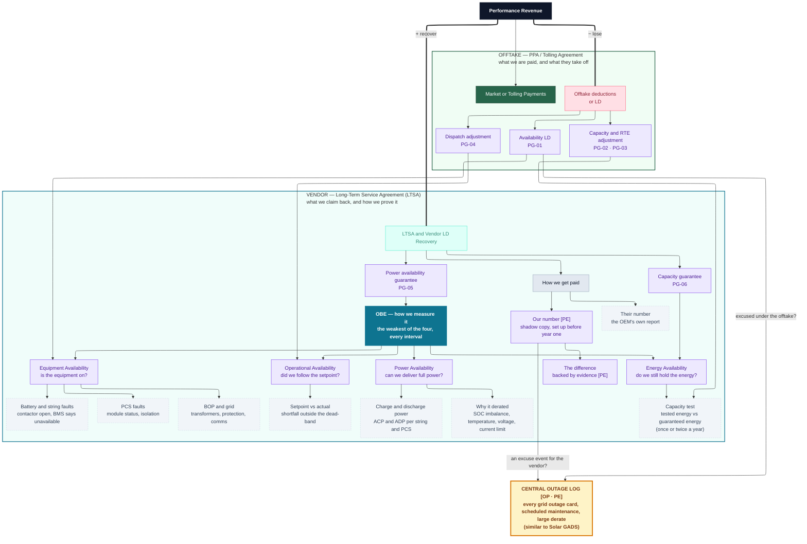

# Metrics Tree & KPIs

**Project:** `{{PROJECT_NAME}}`  **Market/ISO:** `{{ISO}}`  **Version:** `{{VERSION}}`  **Last updated:** `{{DATE}}`
**Source EIM version:** `{{EIM_VERSION}}`

> **One document, three layers.** The **tree** is the map: everything that affects revenue, grouped by the agreement that governs it, down to the KPIs a performance engineer monitors. The **metric definitions** below it are the authority, one calculation per metric so every system produces the same number, and they are where each number gets its source and boundary. The **KPI table** is the short list held against targets.

> **Metric vs KPI.** A **metric** is a calculated quantity with exactly one authoritative definition (formula, data source, boundary, clock), so the platform, the vendor, the offtaker, and the monthly report produce the *same number*. A **KPI** is a metric held against a **target**. Every KPI is a metric; most metrics are not KPIs. Where a quantity carries **two contractual definitions** (availability and RTE routinely differ between the offtake agreement and the service agreement), define **two metrics, one per contract**, each with its own sheet and reporting chain. Never merge them.

> ### 🔗 View this diagram online
>
> A published, view-only copy is easier to read and pan than the block below:
>
> **[BESS-Groundwork Metric Tree on Mermaid.ai](https://mermaid.ai/d/c658a0fc-b68f-4dd5-a42d-1168ffb6086d)**
>
> **The diagram in this file is the source of truth.** The online copy is a convenience, not the record:
>
> - **It drifts.** Edit either copy and they diverge. Re-sync the block below after editing online, and re-fetch the online copy before editing it, because concurrent edits overwrite rather than merge.
> - **Access is not guaranteed.** Publishing depends on a subscription that may lapse, so the link may stop working. Nothing in this repo may depend on it, which is why the block below is the record.
>
> *Working in a clone? Replace the link with your own diagram, or delete this callout.*

## What the tree is

A single map of **everything that affects revenue**, so that each box on it can be monitored. It shows how faults and shortfalls roll up through the four availability types into the contractual numbers that move money.

It is deliberately shaped around **what a performance engineer monitors**, not around a generic revenue model. It stops at the KPI level on purpose: **where each number comes from is not a question for this tree.** Systems, tags and interfaces are settled later, in the [Data Interface Register](../Data_Interface_Register%28DIR%29/data-interface-register.md), and putting them here only crowds out the thing the tree is for.

**What it is for:**

- **Root-causing a headline miss.** Walk down from the LD or the guarantee, into the availability type responsible, to the fault or signal underneath.
- **Seeing both sides of the same event.** The same outage feeds two contracts with different formulas, clocks, and verdicts. The tree shows both paths and refuses to link them.
- **Setting the monitoring scope.** Every box is something to watch. If a box has no monitoring behind it, that is the gap.
- **Scoping dashboards and the monthly report.** The tree is the menu; pick the nodes each audience needs.

## How to use it

1. Copy this folder for your project (do not edit the base template).
2. Run [`eim-review-build`](../Entity_Interaction_Map%28EIM%29/entity-interaction-map.md) first. The tree references EIM node IDs, and the [Data Interface Register](../Data_Interface_Register%28DIR%29/data-interface-register.md) and [Performance Guarantee Matrix](../Performance_Guarantee_Matrix%28PGM%29/performance-guarantee-matrix.md) supply source references and contractual definitions.
3. **Keep the PG-NN references in step with the [PGM](../Performance_Guarantee_Matrix%28PGM%29/performance-guarantee-matrix.md).** Each LD and guarantee node carries its guarantee ID so the two documents tie together; levels, rates and clocks live in the PGM, never here. **This tree is the source of truth for what gets monitored**, so every node must have a PGM row. PGM §1.3 holds the mapping and lists the rows deliberately not drawn here.
4. Prune or extend to match the actual contract stack. A merchant asset replaces the deductions side with market streams; a project with no service agreement loses the recovery side entirely.
5. Fill the node-definition table and the metric sheets. The **sheets** are where each number gets its source, boundary and clock; the tree deliberately does not carry them.
6. Re-stamp `{{EIM_VERSION}}` whenever the source EIM changes.

## The tree

> **Reading it.** Read down: money, then the guarantee or deduction, then how it is measured, then what sits underneath. The two boxes are the two agreements. Purple nodes resolve to a metric definition below; dashed-grey nodes are what you look at when the purple one moves.

## Reading the tree

### Two agreements, two boxes

The tree is grouped by **the contract that governs the money**, because that is the boundary that decides which formula applies, which clock it runs on, and who you argue with.

**Box 1: OFFTAKE, the PPA or tolling agreement.** What we are paid and what they take off. The market or tolling payment comes in; the deductions come off it, one per contractual mechanism: availability, dispatch, capacity and RTE.

**Box 2: VENDOR, the long-term service agreement.** What we claim back and how we prove it. The guarantees, the measurement behind them, and the claim mechanism. This is the only money the project can actually get **back**, which is why it carries the depth: the offtake side can only ever reduce a payment.

**Between them sits the central outage log**, deliberately outside both.

Anything that does not change a number in one of those two boxes does not belong on the tree. That rule is what keeps it readable, and it is why condition-monitoring items such as temperature envelopes and maintenance schedules are not drawn: they matter operationally and they belong in the [PGM](../Performance_Guarantee_Matrix%28PGM%29/performance-guarantee-matrix.md) exclusions and the SOPs, but they are not a line in the money walk.

### Inside the LTSA box, in build order

The claim is the point, so it follows the order you would actually build it:

1. **The guarantees.** Usually two worth tracking: a **power availability guarantee** and a **capacity guarantee**.
2. **How we measure them.** The power availability guarantee resolves into **OBE**, the four availability types. The capacity guarantee resolves into energy availability and its test.
3. **How that becomes money.** Their number, our number beside it, the difference with its evidence. Without our own number there is no difference to show, and without a difference there is no claim.

| | |
|---|---|
| **EA** Equipment Availability | Is the equipment on? |
| **OA** Operational Availability | Did we follow the setpoint? |
| **PA** Power Availability | Can we deliver full power right now? |
| **QA** Energy Availability | Do we still hold the energy we were promised? |

`OBE = the weakest of the four, averaged over every interval`. The full method is in the [Daily Performance Report §2](../Data_Product%28DP%29/Daily_Performance_Report/daily-performance-report.md); the tree just shows where each one connects to money.

### The central outage log

One log, every event: every outage card raised with the grid operator, every trip, every derate, every piece of major downtime. It sits **outside both boxes on purpose**, because it belongs to neither agreement and is read by both.

The two edges into it are the two questions asked of the same event:

- **Excused under the offtake?** If not, it counts against the availability LD.
- **An excuse event for the vendor?** If so, it comes out of their denominator and they are not charged for it.

**One event, judged twice, and the two verdicts routinely disagree.** A comms failure or a BOP outage is typically the owner's problem under the offtake agreement and excused for the vendor, which is exactly the gap the log exists to make visible. Notice discipline lives here too: a planned outage without its notice on time usually converts to forced, which is a money event created by paperwork rather than by the plant.

The taxonomy is **GADS-aligned**, closest to how Solar GADS handles co-located storage today, since no standalone BESS GADS exists yet. Building it that way from day one means the log exports rather than gets rebuilt when NERC opens BESS reporting. The full event set, cause codes and per-contract verdict fields are specified in the [Outage Tracker](../Data_Product%28DP%29/Outage_Tracker/outage-tracker.md); this node is where it connects to the money.

### The lines that cross between the boxes

Three edges leave the offtake box and land in the LTSA one, and they are the most important thing on the diagram:

- **Availability LD → Equipment Availability**
- **Dispatch adjustment → Operational Availability**
- **Capacity and RTE adjustment → the capacity test**

The offtake side needs only two of the four measures, and it uses **the same nodes**, not copies. So one measurement serves both agreements even though the two contracts calculate, weight and excuse it completely differently. That is the whole argument for measuring the plant once, properly, instead of once per contract.

The two agreements are otherwise drawn with **no line between them**. Different formulas, boundaries, clocks and LD pools, settled separately. Linking them would invite exactly the reconciliation mistake the rest of the toolkit warns about.

**The tree stops at the KPI level.** Which system, tag or interface supplies each number is a separate question, answered in the [Data Interface Register](../Data_Interface_Register%28DIR%29/data-interface-register.md) and in the metric sheets below. Keeping it out is what lets the diagram stay a map of the money rather than a map of the plumbing.

### Node taxonomy

| Class | Style | Meaning |
|-------|-------|---------|
| **Root** | dark | The money walk |
| **Agreement box** | green (offtake) / teal (vendor) | The contract that governs the money inside it |
| **Central log** | amber, heavy border | Shared by both agreements, owned by neither |
| **OBE** | teal | How availability is measured |
| **KPI** | light purple | Resolves to a metric definition in this document |
| **Signal** | dashed grey | Raw or derived quantity, not yet a formal KPI |

### Owner tags

`[PE]` performance engineering, `[AM]` asset manager, `[OP]` operator, `[OEM]` service provider. The performance engineer is deliberately in focus: PE owns the shadow number, the difference and its evidence, the OBE measures, the outage-log QA, and the usage counters. Fill the rest from the RACI session.

## Node-definition table

Fill one row per node. `Metric ref` points to a metric definition sheet below; `Source / DIR ref` points to the interface that produces it. Leave `❓` + owner + date where unknown.

| Node ID | Node | Side | Type | Metric ref | Source / DIR ref | How it is worked out |
|---------|------|------|------|------------|------------------|---------------|
| ROOT | Performance Revenue | — | Outcome | — | derived | payments − deductions + recovery |
| PAYM | Market or Tolling Payments | offtake | Driver | — | settlement | capacity payment or market margin |
| RECOV | Vendor LD Recovery | recover | Head | — | derived | Σ guarantee claims, capped |
| PAGUAR | Power availability guarantee | vendor | KPI | PG-05 | PGM calc sheet | (guarantee − actual) × rate |
| CAPGUAR | Capacity guarantee | vendor | KPI | PG-06 | PGM calc sheet | per shortfall formula |
| CLAIM | How we get paid | recover | Driver | — | process | check, dispute, invoice |
| VENDREP | Their number | recover | Signal | — | OEM report | as published by the OEM |
| SHADOW | Our number | recover | KPI | — | owner-held signals | our replica of their definition |
| DELTA | The difference | recover | KPI | — | derived | ours vs theirs, with evidence |
| LOSE | Offtake deductions | lose | Head | — | settlement | Σ of the deductions below |
| AVLD | Availability LD | offtake | KPI | PG-01 | PGM calc sheet | (guarantee − actual) × rate |
| DISLD | Dispatch adjustment | offtake | KPI | PG-04 | PGM calc sheet | per settlement mechanism |
| CAPLD | Capacity and RTE adjustment | offtake | KPI | PG-02 · PG-03 | PGM calc sheet | per adjustment tables |
| OUTLOG | Central outage log | both | Central | — | Outage Tracker | every event, with a verdict per contract |
| OBE | OBE, how we measure it | both | OBE | OBE | derived | weakest of the four, each interval |
| EA | Equipment Availability | both | KPI | EA | BMS + PCS status | min at string, min at bus, Σ to site |
| OA | Operational Availability | both | KPI | OA | meter + dispatch | intervals inside the dead-band |
| PA | Power Availability | recover | KPI | PA | BMS + PCS | rail-aware min(charge, discharge) |
| QA | Energy Availability | recover | KPI | QA | capacity test | tested energy ÷ guaranteed energy |
| EABAT | Battery and string faults | measure | Signal | ← EA | BMS | contactor state and BMS availability, per string |
| EAPCS | PCS faults | measure | Signal | ← EA | site controller | module status and isolation |
| EABOP | BOP and grid | measure | Signal | ← EA | site controller | transformers, protection, comms |
| PACP | Charge and discharge power | measure | Signal | ← PA | BMS + PCS | ACP and ADP per string and module |
| PDER | Why it derated | measure | Signal | ← PA | site controller | imbalance, temperature, voltage, current limit |
| OSET | Setpoint vs actual | measure | Signal | ← OA | meter + dispatch | shortfall outside the dead-band |
| QTEST | Capacity test | measure | Signal | ← QA | revenue meter | tested vs guaranteed energy |

## Metric definition sheets

One sheet per metric, starting with the money-critical ones: the availability metrics, one per contract, belong first. Event tagging that feeds them lives in the [Outage Tracker](../Data_Product%28DP%29/Outage_Tracker/outage-tracker.md); the four engineering measures are specified in the [Daily Performance Report §2](../Data_Product%28DP%29/Daily_Performance_Report/daily-performance-report.md); this document owns the formulas as used on this project.

### `{{Metric Name}}`

| Field | Value |
|-------|-------|
| **kpi_code** | platform/application code, per the taxonomy ID scheme; blank until ratified |
| **Definition (plain language)** | |
| **What it is / is not** | one line on what it measures and the near-miss quantities it explicitly is *not* (capability vs delivered energy vs setpoint-following are the classic confusions) |
| **Formula** | |
| **Units** | |
| **Measurement boundary** | POI / POM / PCS AC terminals / DC bus, with directional loss treatment |
| **Authoritative data source** | system + tag (DIR interface ref) |
| **Secondary / cross-check source** | |
| **Calculation interval** | and the minimum valid intervals per aggregation period |
| **Aggregation** | how raw → interval → daily → contract period |
| **Timezone & clock convention** | state which contract clock (contract year vs operating year) |
| **Exclusions** | per the governing contract, with notice conditions and caps |
| **Contractual reference** | PGM guarantee ID + clause |
| **Owner of the calculation** | who computes the official number |
| **Reporting chain** | who produces the official number, on what cadence and deadline, and how the owner's shadow double-checks it (deemed-acceptance windows make this urgent) |
| **Known discrepancies between sources** | |

## Starter metric set

These are **metrics**; attach a target below to promote one to a KPI. Prune or extend per the project's contracts.

| kpi_code | Metric | Category | Contractual? |
|----------|--------|----------|--------------|
| | Equipment Availability (EA) | OBE | engineering |
| | Operational Availability (OA) | OBE | engineering |
| | Power Availability (PA) | OBE | engineering |
| | Energy Availability (QA) | OBE | engineering |
| | OBE composite | OBE | engineering |
| | Availability, offtake definition | Availability | Y |
| | Availability, service-agreement definition | Availability | Y |
| | Excused / outage budget burn-down | Outage accounting | derived |
| | Excused-event log quality and notice compliance | Outage accounting | evidence duty |
| | Shadow-vs-vendor availability delta | Recovery | evidence duty |
| | Usable energy capacity / retention (`Q_test`) | Capacity | Y |
| | Round-Trip Efficiency, per contract definition(s) | Efficiency | Y |
| | Auxiliary load | Efficiency | N |
| | Throughput, equivalent cycles, cumulative EFC vs limits | Usage | preservation condition |
| | Dispatch compliance | Market | Y |
| | Telemetry validity vs minimum intervals | Data quality | Y |
| | SOC imbalance / string spread | Battery health | leading indicator |
| | LD accrual vs recovery ledger | Financial roll-up | reporting |

## KPIs: is the project performing?

The short list reviewed monthly. Each row is a metric defined above, held against a target.

| kpi_code | KPI | Metric | Target | Cadence |
|----------|-----|--------|--------|---------|
| | | | | |

## Source-of-truth decision table

Where multiple systems report the "same" quantity, declare the winner.

| Quantity | Candidate sources (per EIM) | Authoritative | Rationale |
|----------|------------------------------|---------------|-----------|
| SOC / energy state | BMS → site controller → offtaker telemetry | | each hop can transform; pick the hop, and declare % vs MWh and installed vs contracted basis |
| Available power (ACP/ADP) | BMS estimate, PCS estimate, owner replica | | vendor estimate is the contractual input; the owner replica is what makes it contestable |
| Active power at boundary | PCS, plant controller, revenue meter | | revenue meter for money, plant controller for control |
| Availability | vendor report, offtaker view, owner event log | | owner event log, reconciled per the Outage Tracker |
| Energy capacity | live telemetry, capacity test, BMS estimate | | the controlled test; telemetry only predicts it |
| Market / benchmark prices | counterparty statements, independent feed | | never verify a counterparty's price with the counterparty's number |

## Reconciliation rules

- **Monthly**: owner-derived availability vs vendor-claimed vs offtaker view. Document deltas beyond `{{TOLERANCE}}` and contest within the contract notice windows. Reconcile the vendor side **monthly, not annually**, because an annual-only check discovers disputes after the evidence window has closed.
- **Telemetry plausibility**: available power ≤ guaranteed capacity; SOC ≤ usable capacity; capacity signals change only on availability or SOH events, so investigate steps; contractual flags logged as events, never dropped.
- **Meter sanity**: revenue-meter intervals vs controller-integrated power within `{{TOLERANCE_%}}`; watch sentinel and rollover values.
- **Clock discipline**: each contract's metrics on that contract's evaluation clock. Never annualise across the wrong one.

## Customization notes

- **Merchant assets replace the deductions side.** Swap the offtake LDs for the market streams (energy arbitrage, ancillary services, capacity), keeping the same discipline: each stream ends in a measured quantity, not a revenue estimate. The recovery side and the OBE measures are unchanged, because the plant is the same plant.
- **No service agreement means no recovery side**, but keep the OBE measures. Without a vendor to claim against they are still how the plant is run and how the offtake deductions get explained.
- **Resist adding conditions.** Temperature envelopes, maintenance schedules, access duties and telemetry validity all matter, but they are excuse-event mechanics and belong in the [PGM](../Performance_Guarantee_Matrix%28PGM%29/performance-guarantee-matrix.md) and the SOPs. Putting them here is what turns a money tree back into an unreadable map of everything.
- **Promote signals to KPIs** as instrumentation matures: when a signal gets a contractual envelope or a dashboard threshold, give it a `kpi_code` and recolor it purple.
- **Keep node IDs stable.** The node-definition table, dashboards, and the Monthly Performance Report reference them; renaming an ID is a breaking change.
- **Keep tree and definitions consistent.** Every purple node must resolve to a metric definition or a starter-set row. A purple node with no definition is a gap to close in-session.

## Open items

Tracked in this folder's `todo.md` (create it with the first item).
