# BESS Master Metrics Tree

**Project:** `{{PROJECT_NAME}}`  **Market/ISO:** `{{ISO}}`  **Version:** `{{VERSION}}`  **Last updated:** `{{DATE}}`
**Source EIM version:** `{{EIM_VERSION}}`

## What is it

A single tree that shows how every metric on a BESS project relates to every other one — how raw leaf signals (SOC, dispatched MWh, MAXENER, clearing prices) roll up through intermediate drivers into the two outcomes anyone actually cares about: **the value the asset realized** and **the health that let it earn that value**. It sits one level *above* the [Metrics & KPIs document](metrics-and-kpis.md): that document defines each number authoritatively; this tree shows where each number lives and what it drives.

## What it's for

- **Root-causing a headline miss** — when revenue or availability is down, walk down the relevant limb to the leaf signal responsible instead of guessing.
- **Prioritizing instrumentation** — leaf nodes still marked as raw signals (not yet a formal KPI) show where measurement is thin.
- **Aligning stakeholders** — owner/investor conversations live on the Commercial limb; O&M and OEM conversations live on the Health limb; the cross-links show how they couple.
- **Scoping dashboards & the monthly report** — the tree is the menu; pick the nodes each audience needs.

## How to use it

1. Copy this folder for your project (do not edit the base template).
2. Run [`eim-review-build`](../Entity_Interaction_Map%28EIM%29/Entity_Interaction_Map%28EIM%29.md) and [`metrics-tree`](metrics-and-kpis.md) first — this tree references their node IDs and KPI IDs.
3. Prune or extend branches to match the project's revenue streams and contractual metrics (a regulation-heavy ERCOT asset and an RA-heavy CAISO asset will have different Commercial limbs).
4. Fill the node-definition table so every leaf traces to a Data Interface Register interface and, where contractual, an Obligation Matrix instrument.
5. Re-stamp `{{EIM_VERSION}}` whenever the source EIM changes.
6. Optionally draft the tree in a cloud Mermaid editor as the single working copy (same pattern as the EIM template's "Working copy" note): the repo file holds a pointer, the folder `log.md`/`todo.md` hold history and open items, and snapshots sync back at milestones.

## The tree

> Two limbs share leaf signals. Solid edges (`-->`) are decomposition / roll-up. Dashed edges (`-.label.->`) are cross-limb couplings where a health metric drives a dollar outcome. Purple nodes map to a formal KPI in the Metrics & KPIs document; dashed-grey nodes are raw or derived signals not yet promoted to a KPI.

```mermaid
flowchart TD
    %% EDGE SEMANTICS: labeled +/−/×/÷/min edges = arithmetic roll-up (the tree doubles as the platform calculation spec);
    %% unlabeled solid = decomposition/data feed; dashed = guardrail/influence. Cite contract clauses as %% comments per branch.
    ROOT["BESS Master Metrics Tree"]:::root

    %% ===================== Top-level limbs =====================
    ROOT === COMM["Commercial Value<br/>realized $ · $/kW-mo"]:::limbC
    ROOT === HEALTH["Asset Health &amp; Performance<br/>composite index · KPI-15"]:::limbH

    %% ===== LIMB A — Commercial Value (what the asset earned) =====
    COMM -->|"+"| GROSS["Gross Market Revenue"]:::driver
    COMM -->|"−"| LEAK["Revenue Leakage / Losses"]:::driver
    COMM -->|"−"| OPEX["Operating Cost Offsets"]:::driver

    GROSS --> ENARB["Energy Arbitrage Margin"]:::driver
    GROSS --> ASREV["Ancillary Services Revenue"]:::driver
    GROSS --> CAPREV["Capacity / RA Revenue"]:::driver

    ENARB -->|"×"| DISMWH["Dispatched Energy MWh"]:::signal
    ENARB -->|"×"| SPREAD["Captured Price Spread $/MWh"]:::signal
    ENARB --> CAPTURE["Market Capture vs Benchmark<br/>KPI-14"]:::kpi

    ASREV -->|"×"| ASMW["AS MW Awarded"]:::signal
    ASREV -->|"×"| ASPRICE["AS Clearing Price"]:::signal
    ASREV --> AGC["Dispatch / AGC Compliance<br/>KPI-09"]:::kpi

    LEAK --> AVLOSS["Availability Shortfall — lost MWh"]:::kpi
    LEAK --> NCPEN["Dispatch Non-Compliance Penalties"]:::kpi
    LEAK --> TELPEN["Telemetry / Uptime Penalties"]:::kpi
    LEAK --> DEGLOSS["Degradation Capacity Loss"]:::kpi

    OPEX --> AUXC["Auxiliary Load Cost<br/>KPI-07"]:::kpi
    OPEX --> RTEC["Charging Losses — RTE drag"]:::kpi

    %% ===== LIMB B — Asset Health & Performance (why it could earn) =====
    HEALTH --> AVAIL["Availability"]:::driver
    HEALTH --> CAP["Capacity / State of Health"]:::driver
    HEALTH --> EFF["Efficiency"]:::driver
    HEALTH --> BHEALTH["Battery Health — leading"]:::driver
    HEALTH --> DQ["Data Quality"]:::driver

    AVAIL --> PLANTAV["Plant Availability %<br/>KPI-01"]:::kpi
    AVAIL --> FOR["Forced Outage Rate<br/>KPI-13"]:::kpi
    AVAIL --> MTTR["MTTR / MTT-Respond<br/>KPI-12"]:::kpi
    PLANTAV --> BATAV["Battery Availability %<br/>KPI-02"]:::kpi
    PLANTAV --> PCSAV["PCS Availability %<br/>KPI-03"]:::kpi
    PLANTAV --> BOPAV["BOP / Grid Availability"]:::signal

    CAP --> USABLE["Usable Energy Capacity MWh<br/>KPI-04 · MAXENER"]:::kpi
    CAP --> SOH["State of Health %<br/>KPI-05"]:::kpi
    CAP --> CYCLES["Throughput / Equiv. Cycles<br/>KPI-08"]:::kpi

    EFF --> RTE["Round-Trip Efficiency %<br/>KPI-06"]:::kpi
    EFF --> AUX["Auxiliary Load<br/>KPI-07"]:::kpi

    BHEALTH --> SOCIMB["SOC Imbalance / String Spread<br/>KPI-11"]:::kpi
    BHEALTH --> THERM["Temperature Envelope"]:::signal
    BHEALTH --> VSPREAD["Cell Voltage Spread"]:::signal

    DQ --> TELEM["Telemetry Accuracy &amp; Uptime<br/>KPI-10"]:::kpi

    %% ===== Guardrails (dashed) — health drives $; every lever has a counter-metric =====
    PLANTAV -.drives.-> AVLOSS
    AGC -.shortfall.-> NCPEN
    TELEM -.shortfall.-> TELPEN
    SOH -.erodes.-> DEGLOSS
    RTE -.drag.-> RTEC
    USABLE -.bounds.-> DISMWH
    CYCLES -.degrades.-> SOH

    %% ===== Styles =====
    classDef root fill:#0f172a,stroke:#0f172a,color:#ffffff,font-weight:bold;
    classDef limbC fill:#065f46,stroke:#065f46,color:#ffffff,font-weight:bold;
    classDef limbH fill:#1e3a8a,stroke:#1e3a8a,color:#ffffff,font-weight:bold;
    classDef driver fill:#e2e8f0,stroke:#94a3b8,color:#0f172a;
    classDef kpi fill:#ede9fe,stroke:#7c3aed,color:#4c1d95;
    classDef signal fill:#f1f5f9,stroke:#cbd5e1,color:#334155,stroke-dasharray:3 3;
```

## Edge & owner semantics

- **Labeled solid edges carry arithmetic operators** (`+ − × ÷ Σ min`) wherever the parent is literally computed from the children — this makes the money limbs a computable calculation graph and the implementation spec for the data platform (pair with a `kpi_code` column in Metrics & KPIs when codifying).
- **Unlabeled solid edges** = decomposition or data feed. **Dashed edges = guardrails**: the counter-metric that punishes optimizing a lever naively (the classic failure mode of single-metric management).
- **Owner tags** (e.g. `[PE]` performance engineering, `[AM]` asset manager, `[GOP]`, `[OEM]`) mark who runs each node — a person/role, not a company; fill from the RACI session. Tag at minimum every verification artifact (shadow calculations, evidence logs, reports).
- **Data-source leaves** (add a blue `:::src` class per project) bottom out every branch in a physical source system, cross-referenced to its Data Interface Register `SYS-NN`/`IF-NN` row — an unreliable source leaf makes every node above it unverifiable, which is the instrumentation-priority argument in one picture.
- **Contract references** live as non-displaying `%%` comments per branch (instrument, clause, executed date), so every number on the tree is checkable without cluttering the render.

## Node taxonomy

| Class | Style | Meaning |
|-------|-------|---------|
| **Outcome** | dark | The two headline results — Commercial Value and Asset Health (root + limbs). |
| **Driver** | grey | Intermediate aggregation; a roll-up of lower nodes, not directly measured. |
| **KPI** | purple | Maps to a formal KPI sheet in `metrics-and-kpis.md`. The official number lives there. |
| **Signal** | dashed grey | Raw or derived measurement not yet promoted to a KPI. Candidate for instrumentation. |

## Node-definition table

Fill one row per node. `KPI ref` points to the Metrics & KPIs sheet; `Source / DIR ref` points to the Data Interface Register interface that produces it; leave `❓` + owner + date where unknown.

| Node ID | Metric | Limb | Type | KPI ref | Source / DIR ref | Roll-up logic |
|---------|--------|------|------|---------|------------------|---------------|
| COMM | Commercial Value | — | Outcome | — | settlement pack | GROSS − LEAK − OPEX |
| GROSS | Gross Market Revenue | Commercial | Driver | — | ISO settlement | ENARB + ASREV + CAPREV |
| ENARB | Energy Arbitrage Margin | Commercial | Driver | — | ISO + meter | DISMWH × SPREAD |
| DISMWH | Dispatched Energy MWh | Commercial | Signal | — | POI revenue meter | Σ interval discharge |
| SPREAD | Captured Price Spread | Commercial | Signal | — | ISO LMP | discharge price − charge price |
| CAPTURE | Market Capture vs Benchmark | Commercial | KPI | KPI-14 | optimizer vs perfect-foresight | realized ÷ benchmark $ |
| ASREV | Ancillary Services Revenue | Commercial | Driver | — | ISO settlement | ASMW × ASPRICE × perf |
| AGC | Dispatch / AGC Compliance | Commercial | KPI | KPI-09 | ISO performance metrics | follows AS payment perf factor |
| CAPREV | Capacity / RA Revenue | Commercial | Driver | — | RA/capacity contract | contracted MW × price |
| LEAK | Revenue Leakage / Losses | Commercial | Driver | — | derived | Σ of shortfalls + penalties |
| AVLOSS | Availability Shortfall (lost MWh) | Commercial | KPI | ←KPI-01 | derived from PLANTAV | downtime × foregone $ |
| NCPEN | Dispatch Non-Compliance Penalties | Commercial | KPI | ←KPI-09 | ISO settlement | penalty schedule |
| TELPEN | Telemetry / Uptime Penalties | Commercial | KPI | ←KPI-10 | ISO settlement | penalty schedule |
| DEGLOSS | Degradation Capacity Loss | Commercial | KPI | ←KPI-04/05 | derived | Δ usable MWh × $ |
| OPEX | Operating Cost Offsets | Commercial | Driver | — | derived | AUXC + RTEC |
| AUXC | Auxiliary Load Cost | Commercial | KPI | KPI-07 | aux meter | aux MWh × price |
| RTEC | Charging Losses (RTE drag) | Commercial | KPI | ←KPI-06 | meter | (1 − RTE) × charge $ |
| HEALTH | Asset Health & Performance | — | Outcome | KPI-15 | APM | composite health index |
| AVAIL | Availability | Health | Driver | — | APM / OMS / CMMS | PLANTAV family |
| PLANTAV | Plant Availability % | Health | KPI | KPI-01 | APM derived | uptime ÷ period (net exclusions) |
| BATAV | Battery Availability % | Health | KPI | KPI-02 | BMS / OEM | per OEM guaranty |
| PCSAV | PCS Availability % | Health | KPI | KPI-03 | PCS / EMS | per PCS uptime |
| BOPAV | BOP / Grid Availability | Health | Signal | — | SCADA | grid + BOP uptime |
| FOR | Forced Outage Rate | Health | KPI | KPI-13 | OMS / CMMS | forced hours ÷ period |
| MTTR | MTTR / MTT-Respond | Health | KPI | KPI-12 | LTSA CMMS | per SA response times |
| CAP | Capacity / State of Health | Health | Driver | — | APM | USABLE/SOH family |
| USABLE | Usable Energy Capacity MWh | Health | KPI | KPI-04 | MAXENER / cap test | measured usable MWh |
| SOH | State of Health % | Health | KPI | KPI-05 | BMS estimate | usable ÷ nameplate |
| CYCLES | Throughput / Equivalent Cycles | Health | KPI | KPI-08 | meter / BMS | Σ throughput ÷ rated energy |
| EFF | Efficiency | Health | Driver | — | meter | RTE + AUX |
| RTE | Round-Trip Efficiency % | Health | KPI | KPI-06 | meter | discharge ÷ charge energy |
| AUX | Auxiliary Load | Health | KPI | KPI-07 | aux meter | aux MWh, % of throughput |
| BHEALTH | Battery Health (leading) | Health | Driver | — | BMS | imbalance + thermal |
| SOCIMB | SOC Imbalance / String Spread | Health | KPI | KPI-11 | string BMS | max − min SOC across strings |
| THERM | Temperature Envelope | Health | Signal | — | BMS thermal | cell temp distribution |
| VSPREAD | Cell Voltage Spread | Health | Signal | — | string BMS | max − min cell V |
| DQ | Data Quality | Health | Driver | — | platform | telemetry KPIs |
| TELEM | Telemetry Accuracy & Uptime | Health | KPI | KPI-10 | APD/APC/SOC/MAXENER feeds | valid samples ÷ expected |

## Customization notes

- **Revenue streams vary by market.** Replace the `GROSS` children (`ENARB`/`ASREV`/`CAPREV`) with the project's actual streams — e.g. ERCOT RegUp/RegDown/RRS/ECRS/Non-Spin, CAISO RA + RegMileage + SP, or a tolling structure where the toller takes dispatch risk (then the Commercial limb collapses to the tolling availability/performance terms).
- **Tolling assets** often have no market limb at all. A proven full-toll pattern is **four limbs**: (1) *Contract Revenue* — the fixed capacity payment minus the LD/adjustment deductions, with the availability LD drilled through the outage log and attribution classes down to equipment-level monitoring branches, and the capacity LD drilled through the performance test to its drivers; (2) *LTSA LD Recovery* — a full claim tree per OEM guarantee (measurement basis, OEM self-assessment report vs owner shadow, evidence-log delta, claim/verify/invoice mechanism, shared caps); (3) *Operating Costs* — deliberately shallow, acknowledged but not decomposed; (4) *Warranty & Guarantee Preservation* — the voiding/termination-risk monitors (usage limits, throughput cliffs, PM, temperature, telemetry validity) whose breach forfeits recovery rights. Keep offtake-side and OEM-side availability as **fully independent KPIs** (different formulas, boundaries, clocks, LD pools — no cross-link), each with its own calculation and reporting/verification chain.
- **Promote signals to KPIs** as instrumentation matures: when `THERM` or `VSPREAD` gets a contractual envelope or a dashboard threshold, give it a KPI-NN id and recolor it purple.
- **Keep node IDs stable** — the node-definition table, dashboards, and the Monthly Performance Report reference them. Renaming an ID is a breaking change.
