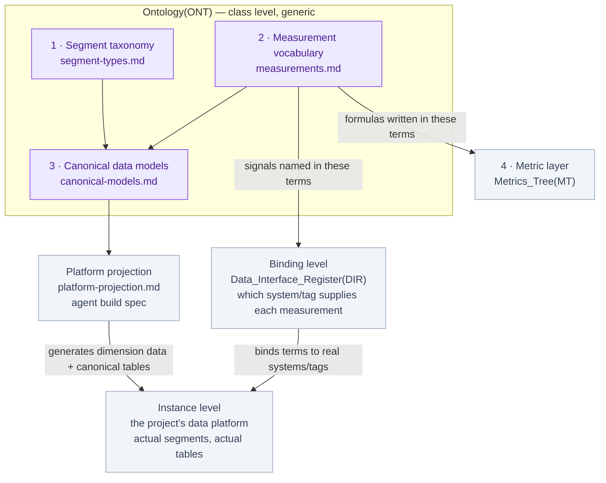

# Groundwork Ontology (ONT)

**Project:** `{{PROJECT_NAME}}`  **Version:** `{{VERSION}}`  **Last updated:** `{{DATE}}`

> **Every other document in this toolkit uses words. This one is where the words are ratified as identifiers.** When the Metrics Tree writes a formula, the Data Interface Register names a signal, or a dashboard labels a panel, the terms they use should resolve here: to exactly one segment type, one measurement term, one unit, one definition. If two documents can disagree about what "state of charge" means, the ontology is not done.

## What it is

A lightweight applied ontology for a BESS project, in four layers:

1. **[Segment taxonomy](segment-types.md)**: the classes of *things* a plant decomposes into (BESS, PCS, battery string, DC bus, transformer, meter), each with a stable type ID, a containment parent, a definition, and synonyms.
2. **[Measurement vocabulary](measurements.md)**: the controlled list of *quantities* those things produce (voltage, cell temperature, state of charge), each with exactly one canonical name, one unit, one datatype, and one definition.
3. **[Canonical data models](canonical-models.md)**: per segment type, the standard shape of its time-series record, which measurement terms it carries, at which statistics, under which column names. This is the layer an agent reads to build dimension data and canonical tables on a data platform.
4. **Metric layer**: computed quantities. **Never defined here.** The ontology registers each metric's identifier, its **class**, and a pointer to its one definition home; formulas are written in the measurement terms of layer 2. Three metric classes, and the class decides the home: **performance-guarantee metrics** (a contract defines the calculation; authoritative home is the [PGM](../Performance_Guarantee_Matrix%28PGM%29/performance-guarantee-matrix.md) calc sheet; the metric ID carries the governing contract as a suffix, e.g. `storage_availability_tolling`, because the contract is part of the metric's identity), **engineering metrics** (the owner's physical view; home is the [Metrics Tree](../Metrics_Tree%28MT%29/metrics-tree.md) sheet), and **monitoring metrics** (the long tail; compact Metrics Tree rows, promoted when they earn a sheet). **One definition home per metric; every other appearance is a link** — the tree references a performance-guarantee metric, it never restates its calculation.

Calling it an ontology is deliberate and defensible: it has classes with typed relations, controlled properties with units, synonym mappings, and stable identifiers. The design is informed by the established standards without adopting any of them wholesale: the segment / measurement / observation split follows W3C SOSA/SSN, the term structure follows SKOS, unit discipline follows UCUM/QUDT, and the domain vocabulary is written with IEC 61850 and MESA/SunSpec point models in view. It deliberately omits RDF/OWL machinery: everything here is Markdown tables that project directly onto relational tables (see the [platform projection](platform-projection.md)).

## The three levels, and why this template stays generic

| Level | What it holds | Where it lives |
|:---|:---|:---|
| **Class** | Segment types, measurement terms, canonical models, relation rules. The same for every BESS regardless of platform. | **This folder.** |
| **Binding** | Which system and tag supplies each measurement on *this* project. | [Data Interface Register](../Data_Interface_Register%28DIR%29/data-interface-register.md) |
| **Instance** | The actual segments (the 20,000 strings), the actual tables and rows. | The project's data platform. Never in this repo. |

The template records only the class level, which is why it is platform-agnostic: a Bat_Str has cell voltages whether the platform is ClickHouse, Timescale, or a historian. The [platform projection](platform-projection.md) shows one reference implementation and is explicitly swappable.

## Parameter, measurement, metric

Every quantity in the toolkit is exactly one of three kinds. Getting this wrong is the root of most "two systems disagree" problems.

| Kind | Definition | Example | Recorded where |
|:---|:---|:---|:---|
| **Parameter** | Static, from a datasheet or contract. Changes only by engineering event. | `dc_nominal_energy_kwh`, `cells_in_series` | Segment attribute tables (dimension data) |
| **Measurement** | Observed time-series arriving from the plant at a segment, at a grain. | `cell_voltage_max` at 1-minute | Canonical time-series tables |
| **Metric** | Computed from measurements and parameters by an owned formula over a window. | EA, OBE, RTE, SoH | [Metrics Tree](../Metrics_Tree%28MT%29/metrics-tree.md) definition sheets |

**The test:** if it arrives from the plant, it is a measurement; if you could recompute it from stored data, it is a metric. Vendor-computed quantities you *receive* (the BMS's SoC, the OEM's availability number) are measurements; your own recomputation of the same quantity is a metric. That distinction is the shadow-vs-vendor pattern the Metrics Tree is built on: the two must never share an identifier.

## Identity and relation rules

- **Term IDs are stable identifiers**, exactly like EIM node IDs. `snake_case` for measurement terms and canonical columns, `Snake_Case` for segment type IDs. Renaming one is a breaking change requiring a sweep of every consuming document and the platform projection.
- **One unit per term.** A quantity in a different unit or basis is a different term (`soc_percent` vs `soc_kwh`), never an overload. Unit symbols come from the [measurement vocabulary](measurements.md) unit rules.
- **Statistics are not new terms.** `cell_voltage_min/avg/max` are one term (`cell_voltage`) at three statistics; the statistic lives in the canonical model, not the vocabulary.
- **Relations are typed and enumerated.** Only four exist: `contains` (segment type → segment type), `measures` (segment type → measurement term, expressed as canonical model rows), `computed_from` (metric → measurement/metric, expressed in Metrics Tree sheets), and `synonym_of` (any alias → canonical term). Resist inventing new relation types; the toolkit's other edges (contractual, organizational, data flow) belong to the EIM.
- **Version stamp.** Consuming documents record `ONT_VERSION` the same way satellite documents record `EIM_VERSION`: when the ontology changes, search for the stamp to find what needs review. The ontology itself carries no `EIM_VERSION`; it sits at asset-class level and does not derive from the project's entity map.
- **Glossary tie.** Every term here that travels into prose gets a [Definitions & Taxonomy](../Definitions%28DEF%29/definitions.md) entry; the DT entry carries the human explanation and links back to the term row here. ONT is the identifier authority; DT is the prose authority.

## How to use it

1. Copy this folder with the project clone (do not edit the base template).
2. Run the `ontology` skill session in this order: **prune the segment taxonomy** to the plant actually built, **ratify the measurement vocabulary** (the ambiguity hunt: one unit and one basis per term), then **fill one canonical model per sitting**, starting with the segment type whose telemetry arrives first.
3. Hand the [platform projection](platform-projection.md) to a data-platform agent to build the dimension data and canonical tables from the ratified layers.
4. Stamp `ONT_VERSION` into the Data Interface Register and Metrics Tree when they next revise, and bump this document's version on every change.

## The fill loop: ontology on demand

**The ontology fills on demand, pulled by real metric-building work — never as a big-bang population session.** A term is recorded at the moment a calculation needs it, and not before; speculative vocabulary is how registries rot. The only up-front step is the taxonomy prune (30 minutes, once). After that, building each KPI runs one loop:

1. **Classify the metric** in the [Metrics Tree](../Metrics_Tree%28MT%29/metrics-tree.md): contractual (one metric **per contract**, never merged), physical (the OBE engineering measures, the owner's own view), or standard (starter-set). All three kinds live in the Metrics Tree; the ontology never holds a formula.
2. **Write the formula in measurement terms.** Each quantity the formula names is checked against the [measurement vocabulary](measurements.md). Missing? Ratify it now, in context, with its one unit, basis, and "is not" line: this is the recording moment, and it takes minutes because the confusion is fresh.
3. **Check the canonical model carries each input** at the segment grain the formula reads. A missing column is a model row to ratify against the real tag list; ratify the model of the segment type the telemetry actually reports at, not the level the org chart suggests.
4. **Build the calculation** reading only canonical columns, register its `metric_code`, and log the ratification batch in the folder `log.md`.

Division of labor, stated once: **the ontology records the nouns; the Metrics Tree records the verbs** (formulas, exclusions, clocks); the [Data Interface Register](../Data_Interface_Register%28DIR%29/data-interface-register.md) records where each noun physically comes from. When the same word is measured differently by two parties (vendor-reported capability vs meter-read delivery is the classic), that is two terms in the vocabulary, one metric per contract in the tree, and a shadow metric for the owner's recomputation, none sharing an identifier.

## Customization notes

- **BESS-first, asset-agnostic.** A PV or wind plant swaps the battery chain of the taxonomy for its own equipment chain and keeps everything else: the vocabulary rules, the canonical-model envelope, and the projection method are identical.
- **Prune, do not fork.** A project without a market data feed deletes those terms; it does not redefine them.
- **Additions flow back.** A new segment type or measurement term ratified on a project is a port-back candidate for this template if it is generic.

Open items: tracked in this folder's `todo.md`.
