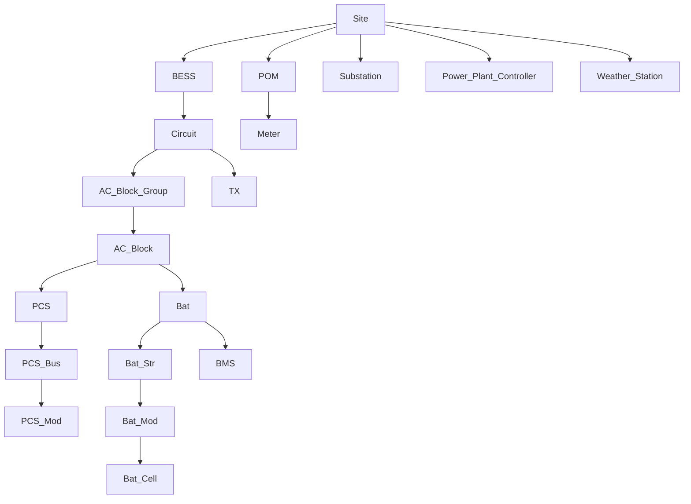

# Segment Taxonomy

**Ontology layer 1** · part of the [Groundwork Ontology](ontology.md)

A **segment** is any thing the plant decomposes into that data can attach to: a physical device, a logical grouping, or an external system boundary. Every telemetry point, parameter, and canonical table row belongs to exactly one segment, and every segment has exactly one type from this table.

**Rules**

- `Seg_Type_ID` is a stable identifier (`Snake_Case`). Renaming one is a breaking change.
- `Parent` is the *typical containment parent* (`contains` relation). Projects vary: a DC-block architecture hangs `Bat` under `PCS`, an AC-block architecture puts PCS and battery inside one `AC_Block`. Record the project's actual hierarchy in the taxonomy document and the platform's segment dimension; this column states the default.
- Synonyms map industry and vendor vocabulary onto the one canonical ID ("inverter" is a PCS here, always).
- Prune types the project does not have; add new ones only with a definition and a parent, and roll them into the [glossary](../Definitions%28DEF%29/definitions.md).

## Plant structure

| Seg_Type_ID | Name | Parent | Definition | Synonyms |
|:---|:---|:---|:---|:---|
| `Site` | Site | — | The overall facility; may contain multiple BESS. | plant, facility, project site |
| `BESS` | BESS | `Site` | One whole battery energy storage system, comprised of circuits and/or AC blocks. | ESS, storage plant |
| `Circuit` | Circuit | `BESS` | An electrical circuit of the BESS comprised of AC blocks. | feeder |
| `AC_Block_Group` | AC Block Group | `Circuit` | A grouping of one or more AC blocks. | block group |
| `AC_Block` | AC Block | `AC_Block_Group` | One or more PCS with one or more batteries, outputting AC power; the integrated enclosure pattern. | ACB, integrated block |
| `POM` | Point of Metering | `Site` | The commercial metering boundary: the revenue meter where delivered energy — and typically every measured guarantee on both sides — is defined. Renamed from `PoC` 2026-09-02 (first-clone lesson): the old name conflated this with the physical point of interconnection (POI), which is a separate boundary that usually carries no metrics; name the POI separately if the project needs it. | PoC (retired), POI basis, revenue-meter point |

## Conversion chain

| Seg_Type_ID | Name | Parent | Definition | Synonyms |
|:---|:---|:---|:---|:---|
| `PCS` | Power Conversion System | `AC_Block` | The battery inverter: converts between the DC battery system and the AC grid side. | inverter, battery inverter |
| `PCS_Bus` | PCS Bus / Power Module Group | `PCS` | A group of PCS power modules connected to a single DC bus. | DC bus (PCS side), power stack |
| `PCS_Mod` | PCS Power Module | `PCS_Bus` | An individual inverter power conversion module. | power module, IGBT stack |
| `TX` | Transformer | `Circuit` | A power transformer (MV or HV). | trafo, transformer |

## Battery chain

| Seg_Type_ID | Name | Parent | Definition | Synonyms |
|:---|:---|:---|:---|:---|
| `Bat` | Battery Enclosure | `AC_Block` | A battery enclosure (container or cabinet) holding one or more battery strings. | DC block, battery container, cube |
| `Bat_Str` | Battery String | `Bat` | A group of battery modules or cells in series forming one string or rack; the usual unit of contactor isolation. | rack, string |
| `Bat_Mod` | Battery Module | `Bat_Str` | A group of battery cells, typically in series, packaged as one replaceable module. | pack, module |
| `Bat_Cell` | Battery Cell | `Bat_Mod` | An individual electrochemical cell. | cell |
| `BMS` | Battery Management System | `Bat` | The control/monitoring system managing battery strings; source of most battery-chain telemetry. | — |

## Grid, protection, and electrical BOP

| Seg_Type_ID | Name | Parent | Definition | Synonyms |
|:---|:---|:---|:---|:---|
| `Substation` | Substation | `Site` | HV substation elements. | — |
| `Circuit_Breaker` | Circuit Breaker | `Substation` | Circuit breaker, ring main unit, or switchgear. | RMU, switchgear |
| `Switch` | Switch | `Substation` | MV/HV switches and disconnectors. | disconnector, isolator |
| `Protection_Device` | Protection Device | `Substation` | Protection relay or power-quality protection device. | relay |
| `Meter` | Meter | `POM` | Energy or power-quality meter used for settlement or performance monitoring; main or auxiliary. | revenue meter, check meter |
| `Electrical_Panel` | Electrical Panel | `Site` | A panel grouping devices such as meters and sensors. | — |
| `BoP` | Balance of Plant | `Site` | Grouping of balance-of-plant equipment not covered by a more specific type. | BOP |

## Control and IT

| Seg_Type_ID | Name | Parent | Definition | Synonyms |
|:---|:---|:---|:---|:---|
| `Power_Plant_Controller` | Power Plant Controller | `Site` | The PPC: site-level control executing grid and dispatch instructions. | PPC, EMS (where the EMS is the controller) |
| `Scheduler` | Scheduler | `Site` | Power scheduling system issuing dispatch programs to the controller. | dispatch system |
| `IT` | IT Equipment | `Site` | Networking and compute equipment. | network, server |
| `System_Elements` | System Elements Group | `Site` | Grouping for elements tracked only for limited status (not part of the main hierarchy). | — |
| `Indicator` | Indicator | `Site` | Generic type for devices not otherwise classified. Use sparingly; prefer a real type. | — |

## Sensors and environment

| Seg_Type_ID | Name | Parent | Definition | Synonyms |
|:---|:---|:---|:---|:---|
| `Weather_Station` | Weather Station | `Site` | Meteorological station aggregating environmental sensors. | met station |
| `Temperature_Sensor` | Temperature Sensor | `Weather_Station` | Standalone temperature sensor. | — |
| `Humidity_Sensor` | Humidity Sensor | `Weather_Station` | Standalone humidity sensor. | — |
| `Wind_Speed_Sensor` | Wind Speed Sensor | `Weather_Station` | Anemometer. | — |
| `Wind_Direction_Sensor` | Wind Direction Sensor | `Weather_Station` | Wind vane. | — |
| `Rain_Gauge` | Rain Gauge | `Weather_Station` | Precipitation sensor. | — |
| `Pyranometer` | Pyranometer | `Weather_Station` | Solar irradiance sensor. | — |

## Safety and facilities

| Seg_Type_ID | Name | Parent | Definition | Synonyms |
|:---|:---|:---|:---|:---|
| `Fire_Alarm` | Fire Alarm | `Site` | Fire detection and alarm devices. | FACP, fire panel |
| `Emergency_Stop` | E-Stop | `Site` | Emergency stop circuits. | e-stop |
| `Facilities` | Facilities | `Site` | Control room, shelters, HVAC, auxiliary rooms. | aux systems |

## External and commercial

Data-producing boundaries that are segments for data-attachment purposes even though they are not plant equipment.

| Seg_Type_ID | Name | Parent | Definition | Synonyms |
|:---|:---|:---|:---|:---|
| `Market_Data` | Market / Optimizer Data | `Site` | Data boundary for route-to-market optimizer outputs: trades, cashflows, schedules. | PNL data, trading data |

## Containment at a glance

The default hierarchy the `Parent` column encodes (project architectures prune or re-hang branches, see Rules):

